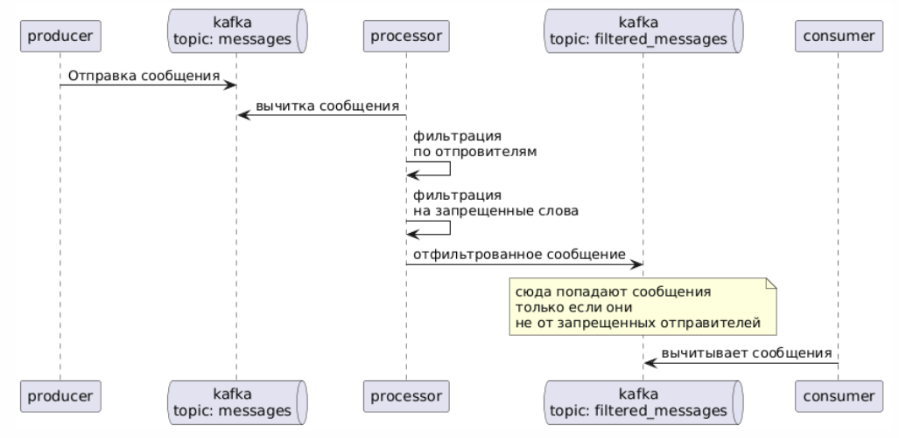
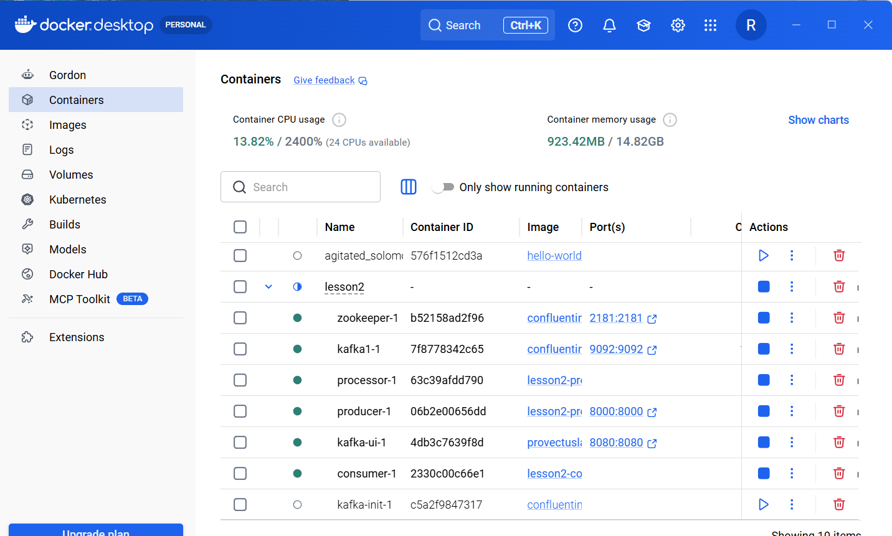
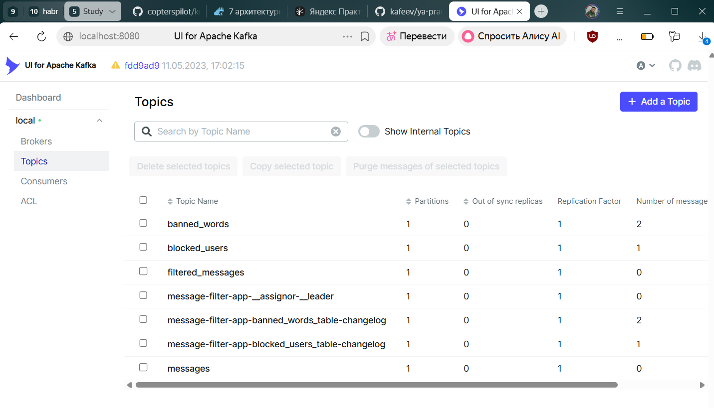
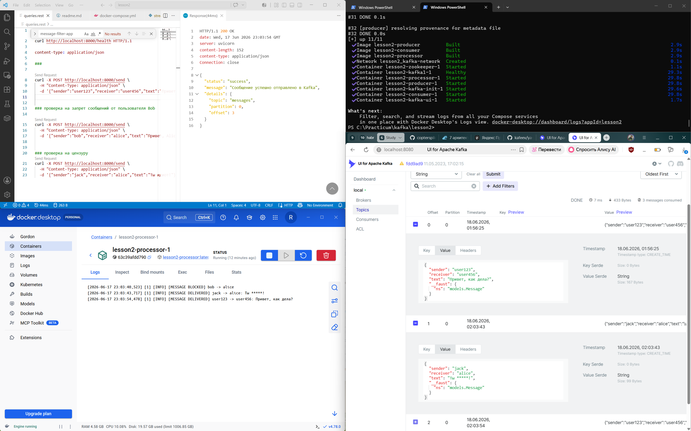

# Kafka + Faust Message Filtering System

## Описание

Система обрабатывает поток сообщений через Apache Kafka и Faust.

Реализованы:

1. Блокировка пользователей.
2. Цензура запрещённых слов.
3. Отправка обработанных сообщений в отдельный Kafka-топик.

---

## Kafka Topics

### messages

Входящие сообщения.

### filtered_messages

Сообщения после обработки.

### blocked_users

Информация о блокировках пользователей.

### banned_words

Список запрещённых слов.

---

## Логика работы



### Блокировка пользователей

Первоначально я прямо в коде закинул в топик заблокированных пользователей пару значений.

Пример:

```pytnon
logger.info("Блокировка пользователя Bob для Alice...")

producer.send(
    "blocked_users",
    {
        "user": "alice",
        "blocked_user": "bob"
    }
)
```

### Блокировка по словам

Далее я также прямо в коде добавил в топик пару запрещенных слов.

```pyton
logger.info("Добавление запрещенных слов...")

producer.send(
    "banned_words",
    {
        "word": "идиот"
    }
)

producer.send(
    "banned_words",
    {
        "word": "дурак"
    }
)

```

прим. конечно можно было бы выставить API метод для этого, но.... реализовал минимально необходимые требования =)

## краткое описание какие сервисы реализованы

- `zookeeper`- для координации кластера
- `kafka1` - сама kafka
- `kafka-init` - просто приложение для создания необходимых топиков в правильно порядке =)
- `kafka-ui` - для удобства контроля\тестирования что куда пишется и как
- `producer` - API сервис для принятия сообщений по http и публикации его в топик **messages**
- `processor` - основной сервис по обработке и фильтрации сообщений по ключевым словам и по заблокированным отправителям
- `consumer` - потребитель сообщений из отфильтрованного топика **filtered_messages**

## Как запустить и приготовить стенд для теста

запускаем одной командой

```bash

docker compose up --build -d

```

далее ждем когда поднимутся все контейнеры



прим. kafka-init - остановится сразу после отработки. так как после создания топиков он не нужен

идем в kafka-ui 
http://localhost:8080/ui/clusters/local/all-topics?perPage=25&hideInternal=true 

и проверям, что там все топкии созданы



## Тестирование

для тестирования я использовал VSCode с extension REST для отправки запросов
все запросы в файле queries.rest

Последовательно отправляем запросы, проверяме через kafka-ui в какие топики они долетели после фильтрации
проверям логи приложения processor



