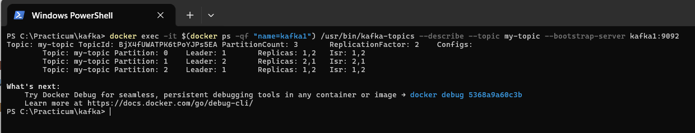
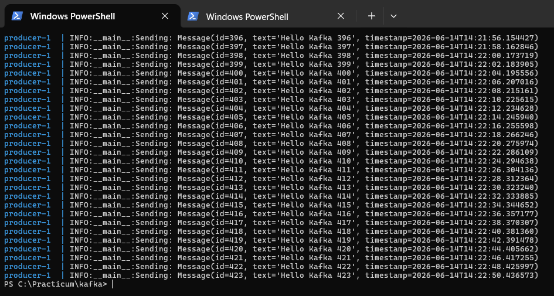
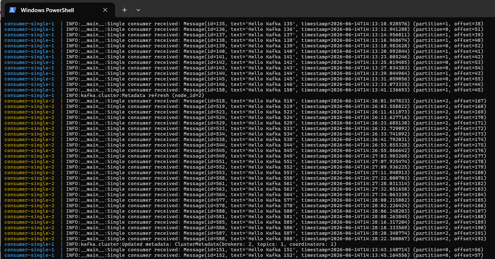
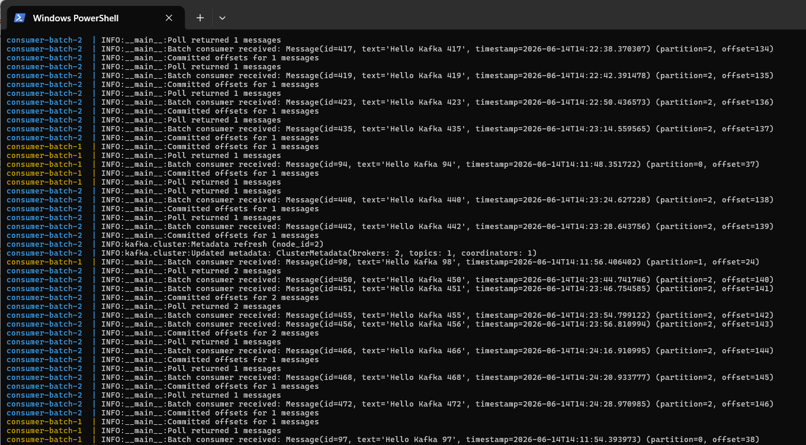

# Kafka кластер с producer и двумя типами consumer (Single / Batch)

## Описание классов и параметров

### Продюсер (producer.py)
- **`acks='all'`** – подтверждение от всех реплик (гарантия at-least-once).  
- **`retries=3`** – повторные попытки при временных ошибках.  
- **`enable_idempotence=True`** – предотвращает дублирование при повторных отправках.  
- **`value_serializer`** – преобразует JSON-строку в байты.  
- Сообщения отправляются каждые 2 секунды.

### Consumer Single (consumer_single.py)
- **`enable_auto_commit=True`** – автоматический коммит оффсетов после каждого сообщения.  
- **`group_id='single-consumer-group'`** – отдельная группа, чтобы не мешать batch consumer'у.  
- **`auto_offset_reset='latest'`** – начинает чтение с новых сообщений.  
- Десериализация через `Message.from_json()`.

### Consumer Batch (consumer_batch.py)
- **`enable_auto_commit=False`** – ручной коммит.  
- **`fetch_min_bytes=10240`** – минимальный объём данных для ответа от брокера (10 KB).  
- **`fetch_max_wait_ms=5000`** – максимальное время ожидания данных.  
- **`max_poll_records=10`** – максимум записей за один `poll()`.  
- **`consumer.commit()`** – синхронный коммит после обработки всех сообщений пачки.  

### Сериализация/десериализация
- Используется JSON через класс `Message` (`to_json`, `from_json`).  
- Ошибки логируются, но не прерывают работу.

### Масштабирование
- Сервисы `consumer-single` и `consumer-batch` имеют `replicas: 2`.  
- Экземпляры одного типа используют одинаковый `group.id`, поэтому делят партиции между собой.  
- Продюсер работает в одном экземпляре.

## Инструкция по запуску и проверке

1. **Сначала запустить только три сервиса**: kafka1, kafka2, zookeeper

```bash
docker-compose up -d zookeeper kafka1 kafka2, kafka-ui
```

2. **Создаем топик** перед запуском продюсера и консюмеров:
```bash
docker exec -it $(docker ps -qf "name=kafka1") /usr/bin/kafka-topics --create --topic my-topic --bootstrap-server kafka1:9092 --partitions 3 --replication-factor 2
```
проверяем что получилось командой:

```bash
docker exec -it $(docker ps -qf "name=kafka1") /usr/bin/kafka-topics --describe --topic my-topic --bootstrap-server kafka1:9092
```

примерный вывод:




Так как в нашей конфигурации kafka отключено автоматическое создание топиков, то елси бы мы запустили продюсера без созданного топика, он бы упал.

3. Теперь только запускаем приложения:
```bash
docker-compose up -d producer consumer-single consumer-batch
```

4. Проверяем, что продюсер пишет сообщения:

```bash
# Продюсер
docker-compose logs producer
```

будет что-то типа:



5. Проверяем, что consumer-single читает сообщения: 

```bash
# Single consumer (оба экземпляра)
docker-compose logs consumer-single
```

примерный вывод



6. Проверяем, что consumer-batch читает сообщения: 

```bash
# Batch consumer 
docker-compose logs consumer-batch
```

примерный вывод



ЧТобы почистить за собой =)

```bash
docker compose down
```
