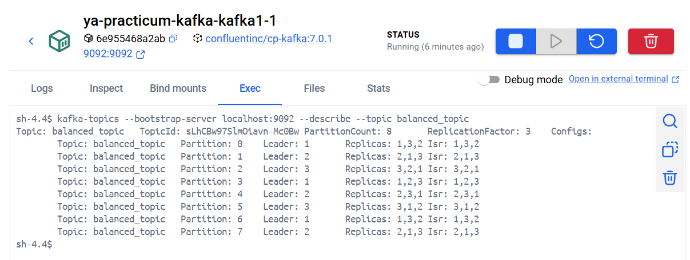
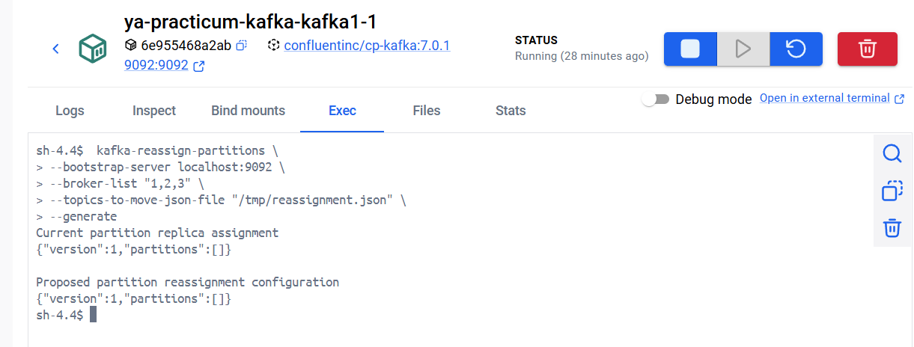
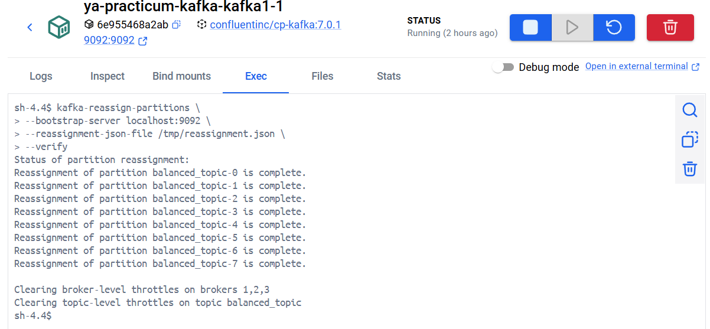
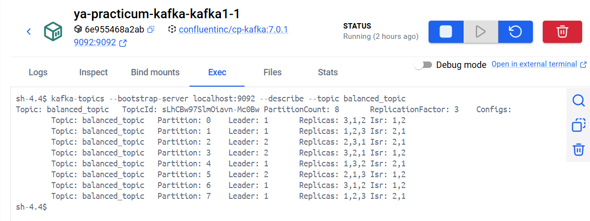
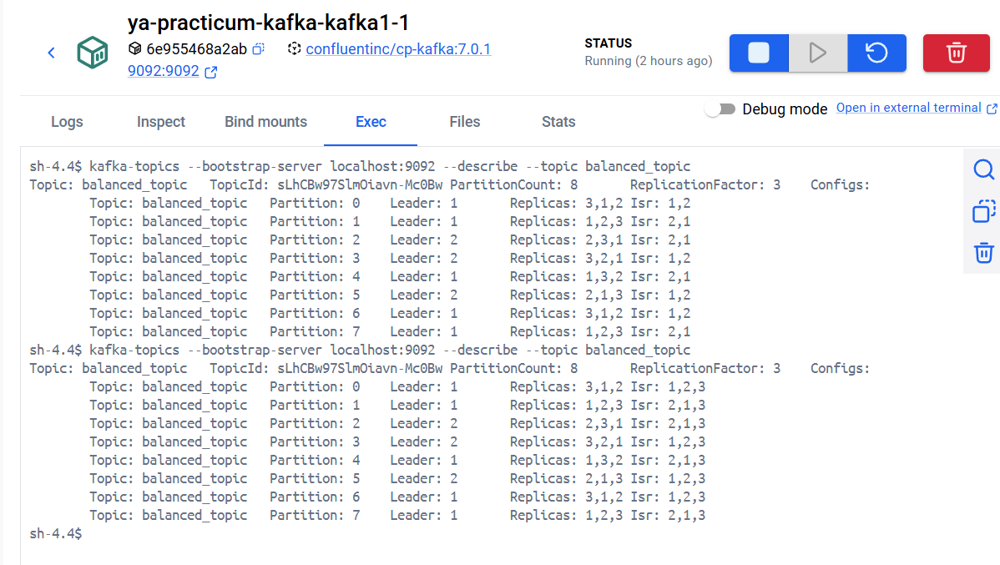

1. Установить инфраструктуру

запуск docker-compose файла
```bash
docker compose up -d
```

2 создать топик
```bash
kafka-topics --bootstrap-server localhost:9092 --create --topic balanced_topic --partitions 8 --replication-factor 3 --if-not-exists
```

3. просмотреть текущее распределени
```bash
kafka-topics --bootstrap-server localhost:9092 --describe --topic balanced_topic
```

будет вывод:



4. создаем файл reassignment.json для перераспределния партиций. Захоим на первый брокер и выполняем в терминале

```bash
cd /tmp

# echo '{
#     "version": 1,
#     "topics": [{"topic": "balanced_topic"}]
# }' > topics_to_move.json

# kafka-reassign-partitions --bootstrap-server localhost:9092 --broker-list "1,2,3" --topics-to-move-json-file "topics_to_move.json" --generate

echo '{
"version":1,
"partitions":[
{"topic":"balanced_topic","partition":0,"replicas":[3,1,2],"log_dirs":["any","any","any"]},
{"topic":"balanced_topic","partition":1,"replicas":[1,2,3],"log_dirs":["any","any","any"]},
{"topic":"balanced_topic","partition":2,"replicas":[2,3,1],"log_dirs":["any","any","any"]},
{"topic":"balanced_topic","partition":3,"replicas":[3,2,1],"log_dirs":["any","any","any"]},
{"topic":"balanced_topic","partition":4,"replicas":[1,3,2],"log_dirs":["any","any","any"]},
{"topic":"balanced_topic","partition":5,"replicas":[2,1,3],"log_dirs":["any","any","any"]},
{"topic":"balanced_topic","partition":6,"replicas":[3,1,2],"log_dirs":["any","any","any"]},
{"topic":"balanced_topic","partition":7,"replicas":[1,2,3],"log_dirs":["any","any","any"]}
]
}' > reassignment.json
```
5. пробуем сгенерировать план по перераспределению
```bash
kafka-reassign-partitions \
--bootstrap-server localhost:9092 \
--broker-list "1,2,3" \
--topics-to-move-json-file "/tmp/reassignment.json" \
--generate
```

будет вывод:



6. применяем изменения

```bash
kafka-reassign-partitions \
--bootstrap-server localhost:9092 \
--reassignment-json-file /tmp/reassignment.json \
--execute
```

и проверяем, что она прошла без ошибок
```bash
kafka-reassign-partitions \
--bootstrap-server localhost:9092 \
--reassignment-json-file /tmp/reassignment.json \
--verify
```
будет примерно такой вывод:



7. проверяме, что балансировка изменилась
```bash
kafka-topics --bootstrap-server localhost:9092 --topic balanced_topic --describe
```

8. останавливаем один брокер и проверямем как изменилось перераспределение
```bash
kafka-topics --bootstrap-server localhost:9092 --describe --topic balanced_topic
```

будет вывод:



**ВНИМАНИЕ:** видим, что пропал один из лидеров (третий)

9. возвращаем брокер обратно и снова проверяем перераспределние
после чего видимм что синхронизация восстановилась:

