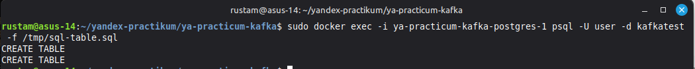
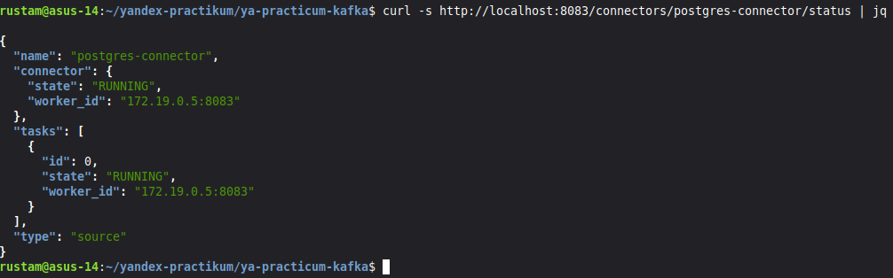
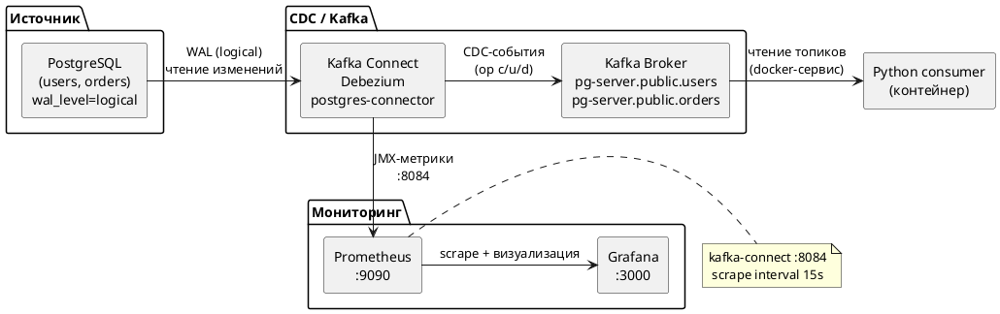
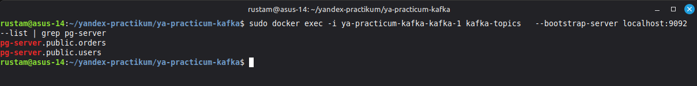
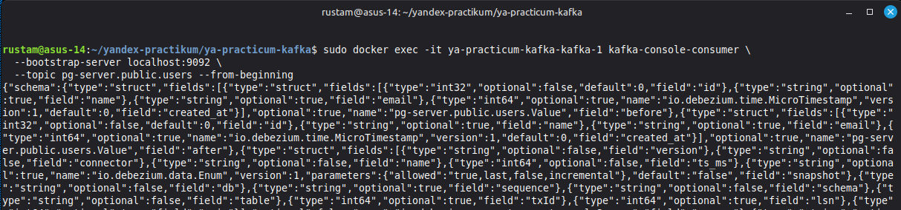
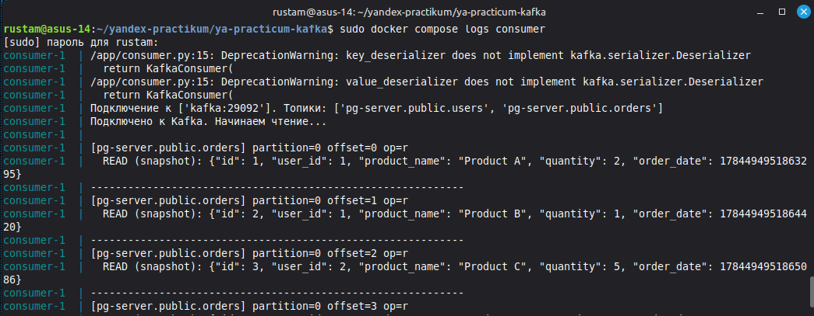
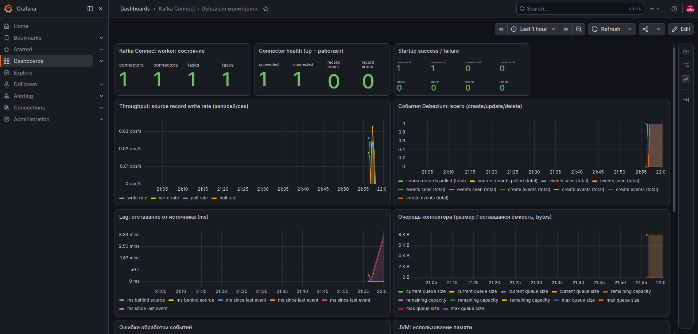
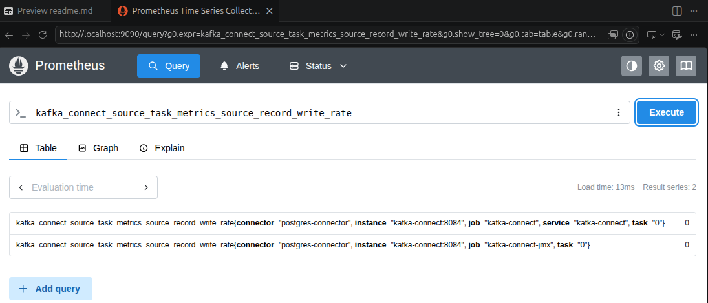

# CDC-конвейер Postgres → Kafka через Debezium

Автоматический захват изменений (CDC — Change Data Capture) из таблиц `users` и `orders`
базы PostgreSQL и доставка их в Kafka через Debezium Connector, с мониторингом
на базе Prometheus и Grafana.

---

## 1. Инструкция по запуску через Docker Compose

### Требования
- Docker и Docker Compose (v2)
- Права на скачивание образов из Docker Hub (интернет)

### Шаги запуска

1. перейти в каталог:

```bash
cd ya-practicum-kafka
```

2. запустить все сервисы в фоновом режиме:

```bash
docker compose up -d
```

3. дождаться старта (Kafka Connect и Debezium требуют ~30-60 сек):

```bash
docker compose ps
```

все сервисы должны быть в состоянии `Up` / `healthy`.

4. создаем таблицы в PostgreSQL:

```bash
# закинем файл sql команда внутрь контейнера для уобства
docker cp sql-table.sql ya-practicum-kafka-postgres-1:/tmp/sql-table.sql
docker exec -i ya-practicum-kafka-postgres-1 psql -U user -d kafkatest -f /tmp/sql-table.sql
```


5. зарегистрируем Debezium Connector:

Конфигурация хранится в файле debezium-connector.json и регистрируется через REST API Kafka Connect (POST /connectors).

Важно: для работы Debezium в Postgres должен быть включён wal_level = logical (в docker-compose.yaml задано через command: postgres -c wal_level=logical).


```bash
curl -X POST http://localhost:8083/connectors \
  -H "Content-Type: application/json" \
  -d @debezium-connector.json
```

6. проверим, что коннектор работает:

```bash
curl -s http://localhost:8083/connectors/postgres-connector/status | jq
```


Ожидаемый результат: 



### Остановка и очистка

```bash
# остановить, сохранив данные (volume)
docker compose down

# полная очистка вместе с данными
docker compose down -v
```

---


### Схема потока данных




**Взаимосвязи:**
- `kafka-connect` подключается к `postgres` (чтение WAL) и к `kafka` (запись в топики `pg-server.public.users`, `pg-server.public.orders`).
- Брокер `kafka` использует `zookeeper` для координации.
- `consumer` — отдельный docker-сервис (собирается из `Dockerfile.consumer`), подключается к брокеру `kafka:29092` внутри сети и выводит CDC-события в свой stdout (`docker compose logs consumer`).
- `kafka-connect` отдаёт JMX-метрики агенту на порту `8084`; `prometheus` забирает их раз в 15с.
- `grafana` берёт данные из `prometheus` и строит графики.


---

## 4. Пошаговая проверка работоспособности (с тестовыми данными)

### Шаг 1. Статус коннектора
```bash
curl -s http://localhost:8083/connectors/postgres-connector/status | jq
```
Должно быть `"state": "RUNNING"` для коннектора и таска.

### Шаг 2. Заливка тестовых данных
```bash
docker cp sql-test-data.sql ya-practicum-kafka-postgres-1:/tmp/sql-test-data.sql
docker exec -i ya-practicum-kafka-postgres-1 psql -U user -d kafkatest -f /tmp/sql-test-data.sql
```
Добавляются 4 пользователя и 5 заказов.

### Шаг 3. Проверка появления топиков
```bash
docker exec -i ya-practicum-kafka-kafka-1 kafka-topics \
  --bootstrap-server localhost:9092 --list | grep pg-server
```
Ожидаемый вывод: 


### Шаг 4. Чтение CDC через консольный consumer
```bash
docker exec -it ya-practicum-kafka-kafka-1 kafka-console-consumer \
  --bootstrap-server localhost:9092 \
  --topic pg-server.public.users --from-beginning
```
Должны появиться сообщения с `op":"c"` (create) и данными строк.



### Шаг 5. Проверка через Python-консьюмер в контейнере

Consumer запущен как отдельный сервис `consumer` в `docker-compose.yaml`
(образ собирается из `Dockerfile.consumer`, подключается к брокеру `kafka:29092`
внутри docker-сети). Он автоматически стартует вместе со всеми сервисами и выводит
в свой stdout все CDC-события из топиков `pg-server.public.users` и `pg-server.public.orders`.

Посмотреть, что он вычитал из топиков:

```bash
docker compose logs consumer
```

Пример вывода (snapshot при первом старте + живые изменения):




### Шаг 6. Проверка через Grafana (визуализация)
1. открываем http://localhost:3000 (логин/пароль: `admin`/`admin`).
2. дашборд **«Kafka Connect + Debezium мониторинг»**.



### Шаг 7. Проверка метрик в Prometheus
- UI: http://localhost:9090 — запрос, напр. `kafka_connect_source_task_metrics_source_record_write_rate`
- Raw-метрики Kafka Connect: http://localhost:8084/metrics



### Ожидаемый итог
- `postgres-connector` в состоянии `RUNNING`;
- вставки в `users`/`orders` попадают в соответствующие топики Kafka;
- сервис `consumer` выводит все изменения (snapshot + живые события) в свой лог (`docker compose logs consumer`);
- Grafana/Prometheus показывают метрики передачи данных и здоровья коннектора.

---


