# Kafka-кластер: 3 брокера + SSL + ACL (KRaft) + Аналитическая платформа

## Общее описание проекта

Этот проект реализует **защищённый кластер Apache Kafka** (3 брокера в режиме KRaft, без ZooKeeper) с **взаимной TLS-аутентификацией (mTLS)** и **ACL-авторизацией**, а поверх него — **аналитическую платформу маркетплейса** в 6 этапов:

| Этап | Компонент | Описание |
|------|-----------|----------|
| **База** | Kafka-кластер | 3 брокера KRaft, SSL-листенеры (9095/9096/9097), контроллерный кворум (9093), mTLS, ACL (`StandardAuthorizer`) |
| **Шаг 1** | Платформа маркетплейса | SHOP API → Kafka (`products`) → Faust-фильтр → `products-allowed` → PostgreSQL; CLIENT API → поиск/рекомендации + логирование в `client_requests` |
| **Шаг 2** | Отказоустойчивость | RF=3, `min.insync.replicas=2`; резервный кластер `backup1/2/3` + MirrorMaker 2 (зеркалирование `products`, `client_requests` → `primary.*`) |
| **Шаг 3** | Аналитика на Spark | Spark Structured Streaming читает `primary.client_requests` из резервного кластера → сырые события в HDFS (JSON, append) + ТОП-10 поисковых запросов в топик `recommendations` |
| **Шаг 4** | Фильтрация запрещённых товаров (Faust) | Потоковый сервис на Faust: читает `products`, сверяет с компактным топиком `forbidden-products` → `products-allowed` / `products-rejected`; управление через CLI без перезапуска |
| **Шаг 5** | Хранение и поиск (PostgreSQL) | `product-sink` пишет только разрешённые товары в БД; полнотекстовый поиск — `tsvector` + GIN-индекс + триггер, ранжирование `ts_rank` |
| **Шаг 6** | Мониторинг | JMX Exporter (javaagent на порту 7071 каждого брокера) → Prometheus (9090) → Alertmanager (9093) → Grafana (3000, admin/admin) + вебхук алертов |

### Технологический стек

| Категория | Инструменты |
|-----------|-------------|
| **Оркестрация** | Docker, Docker Compose |
| **Kafka** | Apache Kafka 7.5.0 (Confluent), KRaft, 3 брокера + 3 резервных, MirrorMaker 2 |
| **Безопасность** | OpenSSL, keytool (JDK) — генерация CA, keystore, truststore, PEM; mTLS; ACL (`StandardAuthorizer`, `allow.everyone.if.no.acl.found=false`) |
| **Python-клиенты** | `kafka-python` (producer, consumer, shop-api, product-sink, client-api), `aiokafka` (Faust) |
| **Потоковая обработка** | Faust (Python-аналог Kafka Streams) — фильтрация запрещённых товаров |
| **База данных** | PostgreSQL 16 — upsert товаров, `client_events`, полнотекстовый поиск (`tsvector`/`GIN`/`ts_rank`) |
| **Аналитика** | Apache Spark 3.5.1 (Structured Streaming) — чтение из Kafka, запись в HDFS, публикация рекомендаций |
| **Хранение данных** | Apache Hadoop HDFS 3.3.6 — «сырые» события аналитики |
| **Мониторинг** | Prometheus + JMX Exporter (метрики брокеров), Alertmanager (маршрутизация алертов), Grafana (дашборды) |
| **Сертификаты** | Готовые сертификаты в `ssl/certs/` (в репозитории), пароль хранилищ: `kafka123` |

---

## Структура проекта

```
.
├── docker-compose.yaml          # весь стенд: 6 брокеров, сервисы, мониторинг
├── producer/  consumer/         # демо продюсер/консьюмер (topic-1), kafka-python
├── shop_api/                    # SHOP API: шлёт товары в products
├── product_sink/                # консьюмер products-allowed → PostgreSQL
├── client_api/                  # терминал поиска/рекомендаций
├── forbidden_filter/            # Faust-фильтр запрещённых товаров + cli.py
├── spark-analytics/             # Spark Structured Streaming (analytics.py)
├── ssl/                         # generate-certs.sh, certs/, config/ (topics/ACL/проперти)
├── mm2/                         # mm2.properties (MirrorMaker 2)
├── init/                        # 01_init.sh — схема БД + полнотекстовый поиск
├── hadoop/ hdfs/                # конфиги и тома HDFS
├── kafka-jmx/                   # Dockerfile + конфиг JMX Exporter
├── monitoring/                  # prometheus, alertmanager, grafana, alert-webhook
└── data/products.json           # тестовые товары (12 шт.)
```

---

## Предварительные требования

- **Docker** + **Docker Compose** (v2, `docker compose`)
- Для повторной генерации сертификатов: `openssl` и `keytool` (JDK) — **не обязательно**, сертификаты уже в `ssl/certs/`
- Порты на хосте: `9095-9097` (основной кластер SSL), `9195-9197` (резервный), `5432` (PostgreSQL), `9090` (Prometheus), `9093` (Alertmanager), `3000` (Grafana), `9870` (HDFS UI), `5050` (alert-webhook)

---

## Быстрый старт (минимальный запуск одной командой)

```bash
# 1) Собрать и поднять все сервисы
docker compose up -d --build

# 2) Создать топики в основном кластере
docker compose exec kafka1 bash /etc/kafka/ssl-config/create-topics.sh

# 3) Настроить ACL (права доступа)
docker compose exec kafka1 bash /etc/kafka/ssl-config/setup-acls.sh

# 4) Проверить, что брокеры здоровы
docker compose ps
```

> **Важно:** Если все сервисы поднялись одной командой, `mirror-maker` может стартовать до создания топиков и не создать зеркальные `primary.*`. В этом случае:
> ```bash
> docker compose restart mirror-maker
> ```
> Spark (`spark-analytics`) сам возобновит работу после появления `primary.client_requests`.

---

## Пошаговая инструкция с проверками

### Шаг 0. Подготовка (если нужно сгенерировать сертификаты заново)

Сертификаты уже лежат в `ssl/certs/` и входят в репозиторий. Генерация не требуется.

Если всё же нужно перегенерировать:
```bash
docker run --rm -v ${PWD}/ssl:/ssl -w /ssl confluentinc/cp-kafka:7.5.0 bash generate-certs.sh
```
Скрипт создаёт CA, truststore, keystore брокеров (SAN `DNS:kafkaN`), keystore клиентов (producer/consumer/admin) и PEM для Python-клиентов. Пароль всех хранилищ: `kafka123`.

---

### Шаг 1. Запуск основного Kafka-кластера (3 брокера)

```bash
docker compose up -d kafka1 kafka2 kafka3
```

**Проверка:**
```bash
docker compose ps
# Все три брокера: Up ... (healthy)
```

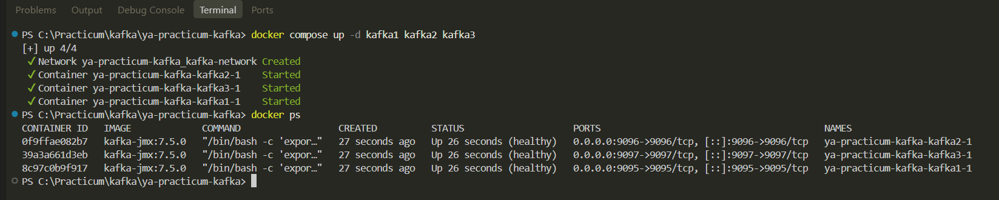

---

### Шаг 2. Создание топиков

```bash
docker compose exec kafka1 bash /etc/kafka/ssl-config/create-topics.sh
```
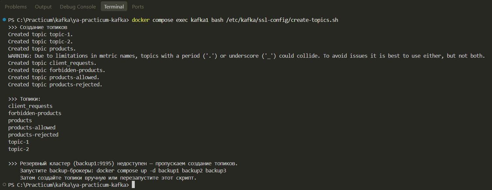

Скрипт создаёт в основном кластере:
- `topic-1`, `topic-2` — демо-топики
- `products`, `client_requests` — топики платформы (3 партиции, RF=3, `min.insync.replicas=2`)
- `forbidden-products` (compacted), `products-allowed`, `products-rejected` — для Faust-фильтра

В резервном кластере создаёт: `recommendations`, `raw_data`.

**Проверка:**
```bash
docker compose exec kafka1 kafka-topics \
  --bootstrap-server kafka1:9095 --command-config /etc/kafka/ssl-config/admin.properties \
  --list
# Ожидаем: topic-1, topic-2, products, client_requests, forbidden-products, products-allowed, products-rejected, ...
```
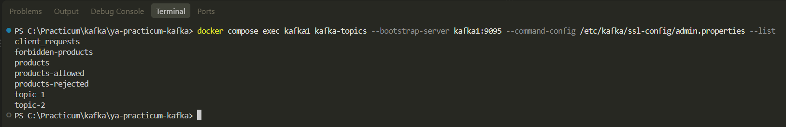

---

### Шаг 3. Настройка ACL

```bash
docker compose exec kafka1 bash /etc/kafka/ssl-config/setup-acls.sh
```

Скрипт выставляет права по принципалам из CN сертификатов:
- `User:producer` — WRITE/READ/DESCRIBE на `topic-1`, `topic-2`, `products`, `client_requests`, `forbidden-products`, `products-allowed`, `products-rejected`; CLUSTER (Create, Describe) для Faust
- `User:consumer` — READ/DESCRIBE на `topic-1`, `products-allowed`
- `User:analytics` — READ/DESCRIBE на `primary.client_requests`, `primary.products`; WRITE/DESCRIBE на `recommendations` (резервный кластер)
- Суперпользователи: `User:admin`, `User:kafka1`, `User:kafka2`, `User:kafka3`, `User:ANONYMOUS`

**Проверка:**
```bash
docker compose exec kafka1 kafka-acls \
  --bootstrap-server kafka1:9095 --command-config /etc/kafka/ssl-config/admin.properties \
  --list
```

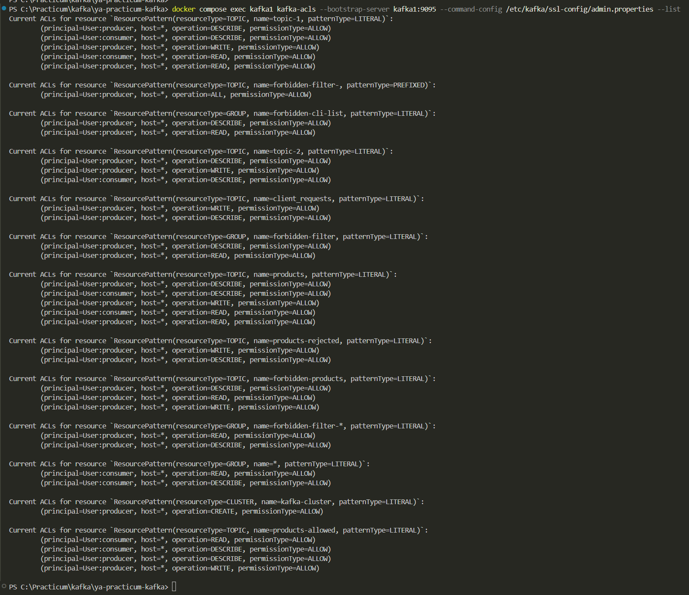

---

### Шаг 4. Запуск платформы маркетплейса (PostgreSQL + Faust-фильтр + сервисы)

**Важно:** `forbidden-filter` (Faust) — обязательный компонент конвейера. Он читает из `products`,
фильтрует и пишет в `products-allowed`. Без него `product-sink` не получит ни одного товара.

```bash
docker compose up -d postgres forbidden-filter shop-api product-sink
```

**Проверка — товары попали в БД:**
```bash
docker compose exec -e PGPASSWORD=marketplace postgres \
  psql -U marketplace -d marketplace -c "SELECT count(*) FROM products;"
# Ожидаем: 12
```
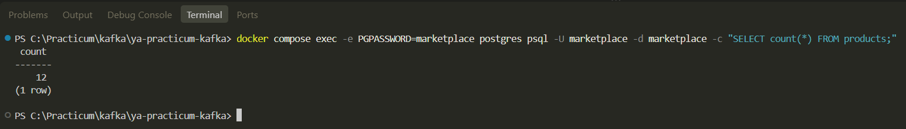

**Логи:**
```bash
docker compose logs -f shop-api       # "Отправлен товар 1001 ..."
docker compose logs -f product-sink   # "Сохранён товар 1001 ..."
```
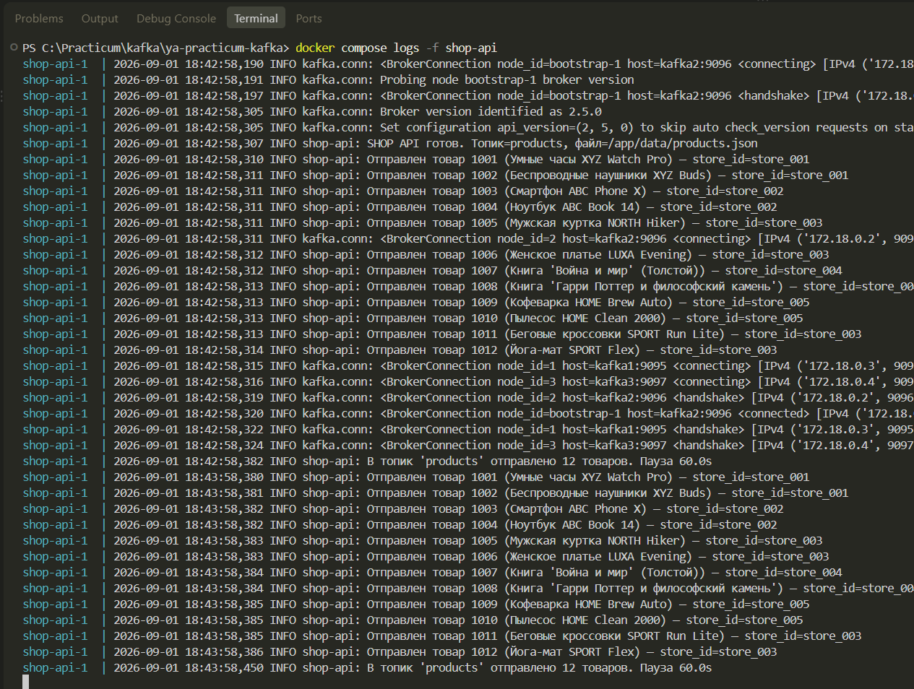

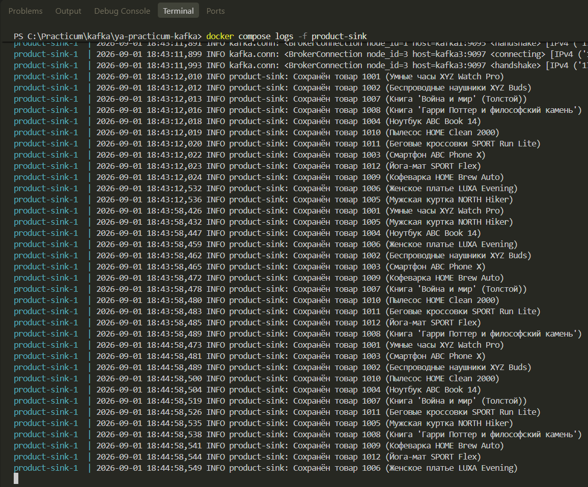

---

### Шаг 5. Запуск резервного кластера + MirrorMaker 2

```bash
docker compose up -d backup1 backup2 backup3
docker compose up -d mirror-maker
```

**Проверка зеркалирования (топики с префиксом `primary.*` в резервном кластере):**
```bash
docker compose exec backup1 kafka-topics \
  --bootstrap-server localhost:9195 --command-config /etc/kafka/ssl-config/admin-backup.properties \
  --list
# Ожидаем: primary.products, primary.client_requests, heartbeats, mm2-*
```
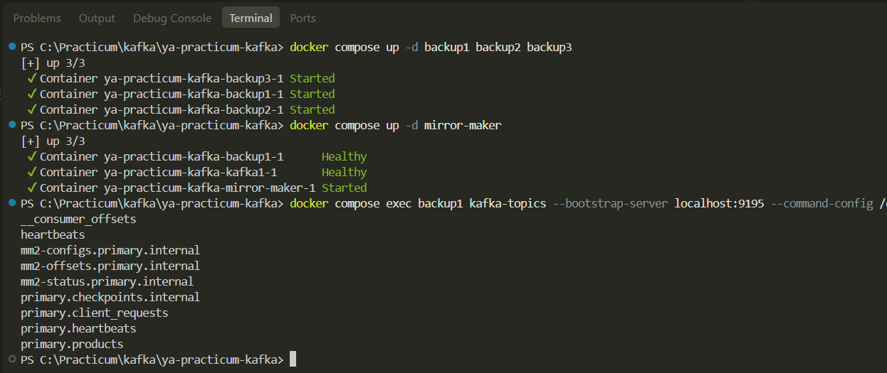

**Прочитать сообщения из резервного кластера:**
```bash
docker compose exec backup1 kafka-console-consumer \
  --bootstrap-server localhost:9195 --consumer.config /etc/kafka/ssl-config/admin-backup.properties \
  --topic primary.products --from-beginning --max-messages 12 --timeout-ms 8000
```
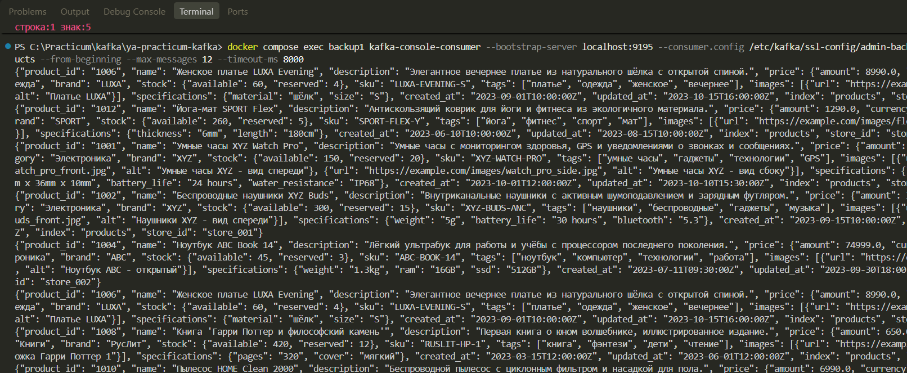

---

### Шаг 6. Запуск аналитики (Spark Structured Streaming + HDFS)

```bash
docker compose up -d spark-analytics
```

**Проверка логов Spark:**
```bash
docker compose logs -f spark-analytics
# [batch N] raw data landed to HDFS (hdfs://hdfs-namenode:8020/user/spark/raw)
# [batch N] recommendations written to topic 'recommendations'
```
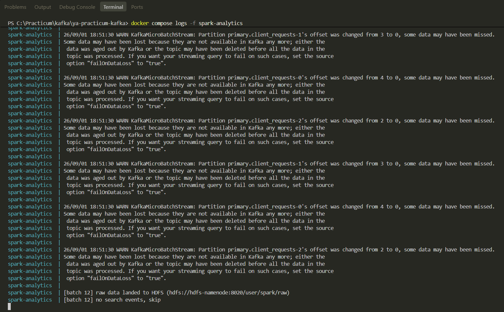

**Прочитать рекомендации из резервного кластера:**
```bash
docker compose exec backup1 kafka-console-consumer \
  --bootstrap-server localhost:9195 --consumer.config /etc/kafka/ssl-config/admin-backup.properties \
  --topic recommendations --from-beginning --max-messages 10 --timeout-ms 8000
```

**Проверить HDFS:**
```bash
docker compose exec hdfs-namenode hdfs dfs -ls /user/spark/raw
```

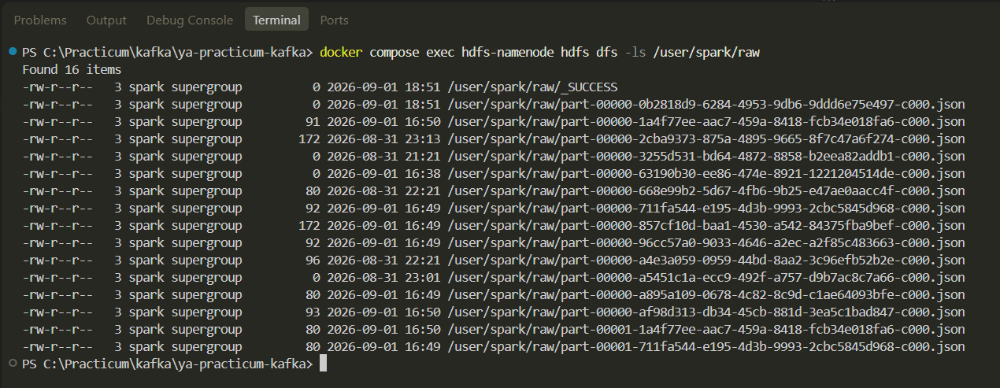

---

### Шаг 7. Управление фильтром запрещённых товаров (Faust CLI)

> **Примечание:** `forbidden-filter` уже запущен на шаге 4. Здесь мы только тестируем CLI-управление списком запрещённых.

**Управление списком запрещённых (CLI):**
```bash
# Добавить товар в запрещённые
docker compose run --rm forbidden-filter python cli.py add 1005 \
  --name "Мужская куртка NORTH Hiker" --reason "запрещён к продаже"
```

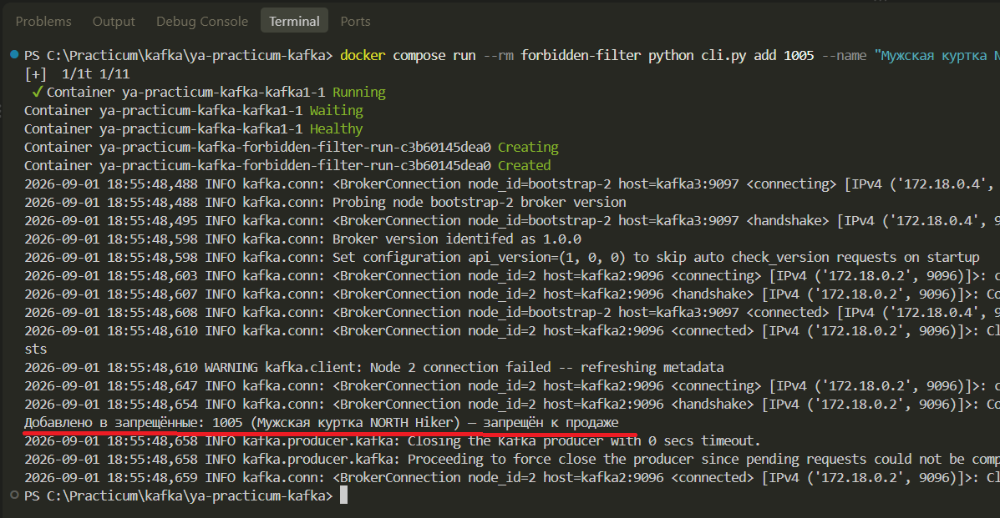

```bash
# Показать текущий список
docker compose run --rm forbidden-filter python cli.py list
```
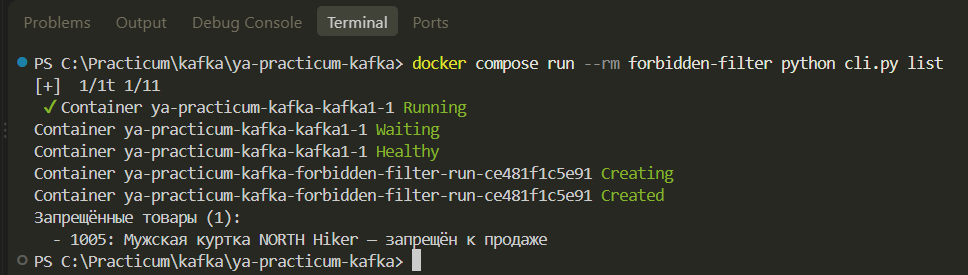

```bash
# Удалить из запрещённых (tombstone в компактном топике)
docker compose run --rm forbidden-filter python cli.py remove 1005
```
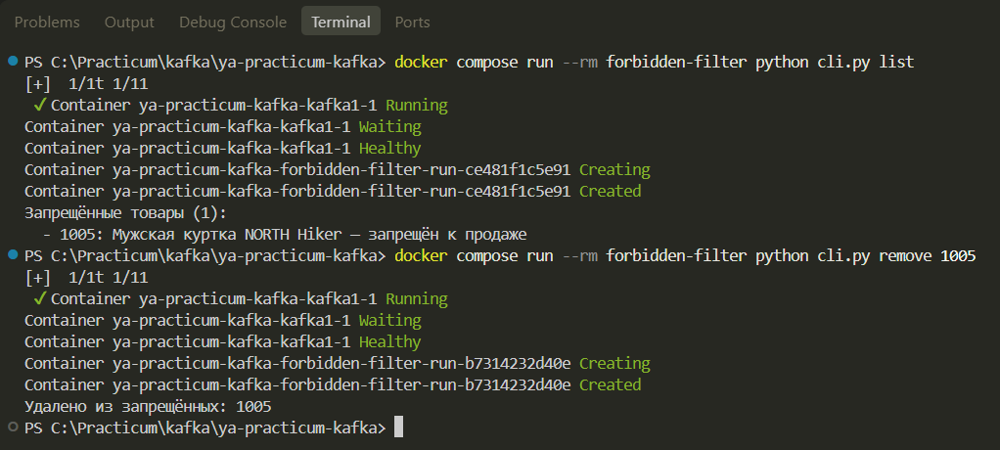

**Проверка фильтрации:**
```bash
# Логи фильтра
docker compose logs -f forbidden-filter
# ПРОПУЩЕН товар 1001 ...
```
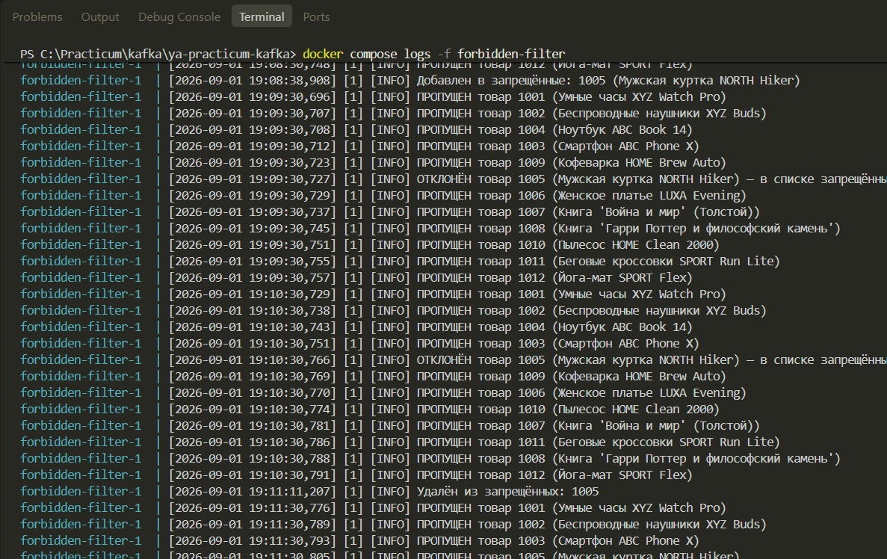

```bash
# Запрещённый товар в products-rejected, НЕ в products-allowed
docker compose exec kafka1 kafka-console-consumer \
  --bootstrap-server kafka1:9095 --consumer.config /etc/kafka/ssl-config/admin.properties \
  --topic products-rejected --from-beginning --max-messages 5 --timeout-ms 8000
```
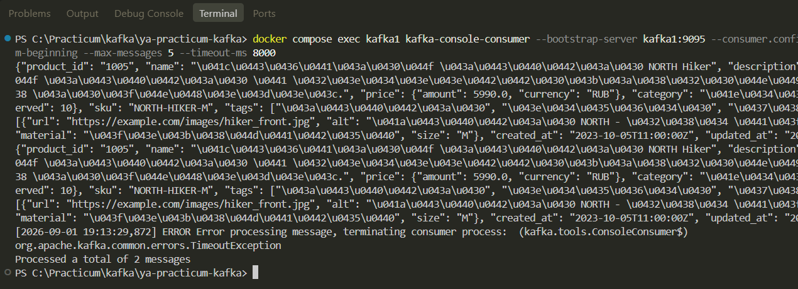

```bash
docker compose exec kafka1 kafka-console-consumer --bootstrap-server kafka1:9095 --consumer.config /etc/kafka/ssl-config/admin.properties --topic products-allowed --from-beginning --max-messages 60 --timeout-ms 8000 | Select-String "1005" | Measure-Object -Line
# 0 — 1005 отфильтрован
```
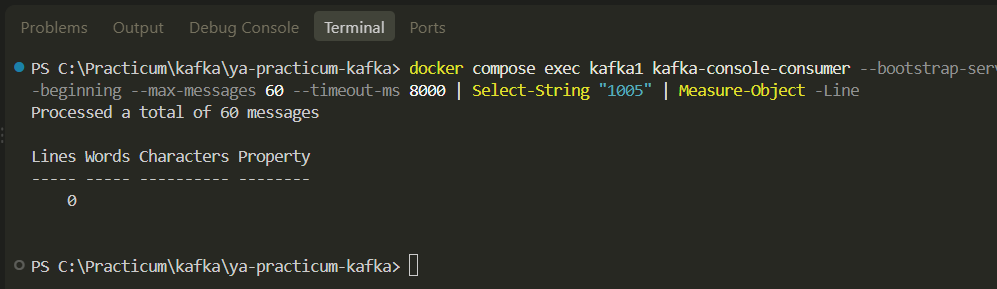

---

### Шаг 8. Запуск мониторинга (Prometheus, Alertmanager, Grafana)

Мониторинг поднимается вместе со всем стендом (`docker compose up -d --build`) либо отдельно:
```bash
docker compose up -d prometheus alertmanager grafana alert-webhook
```

**Доступы к UI:**

| Сервис | URL | Логин/пароль |
|--------|-----|--------------|
| Prometheus | http://localhost:9090 | — |
| Alertmanager | http://localhost:9093 | — |
| Grafana | http://localhost:3000 | admin / admin |
| HDFS UI | http://localhost:9870 | — |
| Alert-webhook | http://localhost:5050 | логи алертов: `docker logs alert-webhook` |

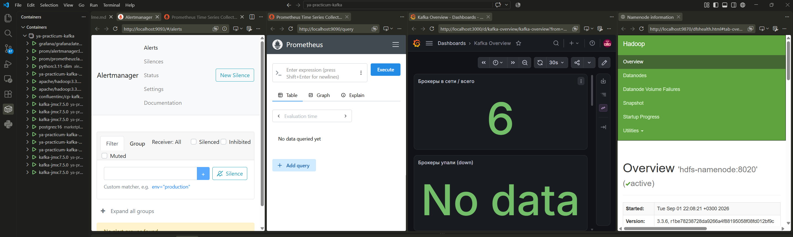

**Проверка метрик брокера (внутри сети):**
```bash
docker compose exec kafka1 curl -s http://localhost:7071/metrics | Select-String "kafka_server" | ForEach-Object { $_.Line }
```

**Тест алерта «брокер упал»:**
```bash
docker stop ya-practicum-kafka-kafka3-1
# Через ~1 минуту:
#   Prometheus -> Alerts -> KafkaBrokerDown (firing) для kafka3:7071
#   Alertmanager -> Alerts -> KafkaBrokerDown (firing)
#   docker logs alert-webhook -> [ALERT firing] KafkaBrokerDown | instance=kafka3:7071
docker start ya-practicum-kafka-kafka3-1  # алерт уходит в resolved
```
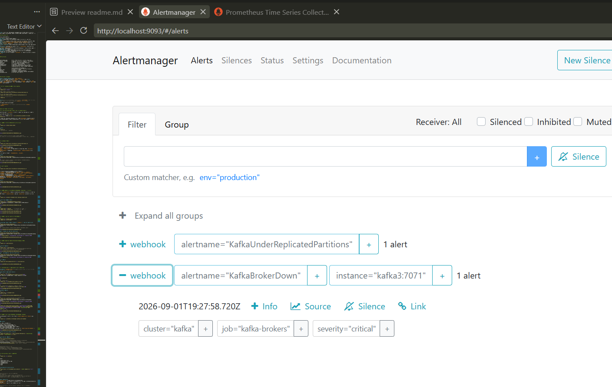
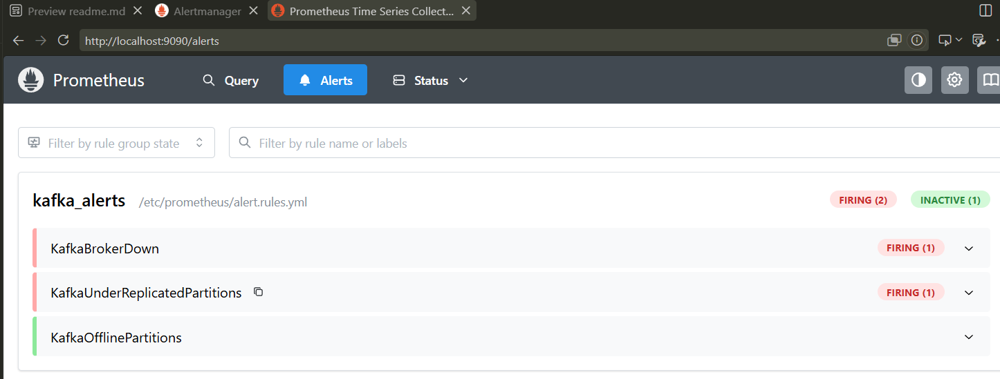
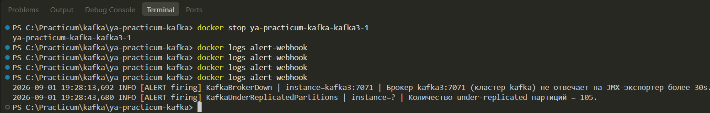

---
после восстановления
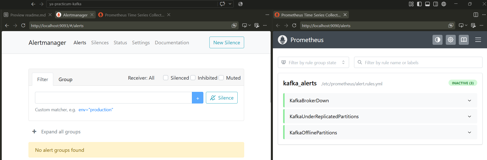
---

### Шаг 9. Интерактивная работа с CLIENT API

```bash
docker compose run -it client-api
```

В терминале:
```
client> search user_1 часы
client> search user_1 смартфон ABC
client> recommend user_1
client> recommend user_2
client> help
client> exit
```

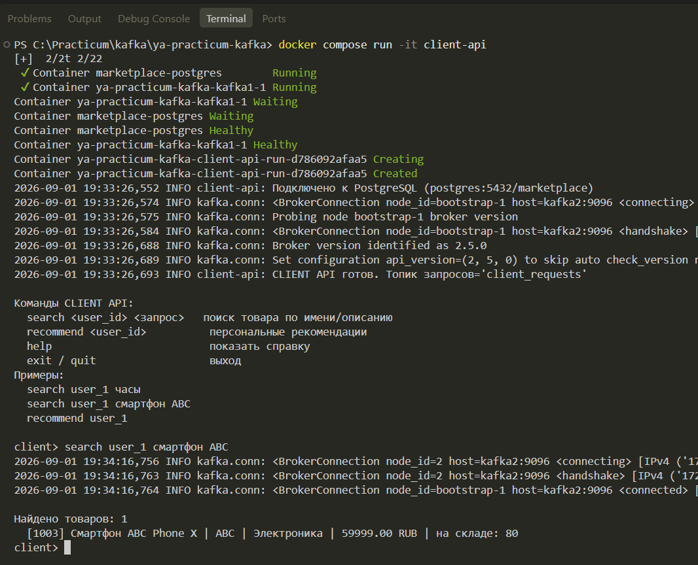

**Неинтерактивная проверка (для CI):**
```bash
"search user_1 часы`nrecommend user_1`nexit" | docker compose run --rm -T client-api
```

---

### Шаг 10. Проверка демо-продюсера/консьюмера (topic-1)

```bash
# запускаем producer \ consumer 
docker compose up -d producer consumer
# Продюсер шлёт сообщения каждые 2 секунды
docker compose logs -f producer

# Консьюмер их читает (topic-1)
docker compose logs -f consumer
# В логах консьюмера появляются блоки "===== RECEIVED MESSAGE ====="
```
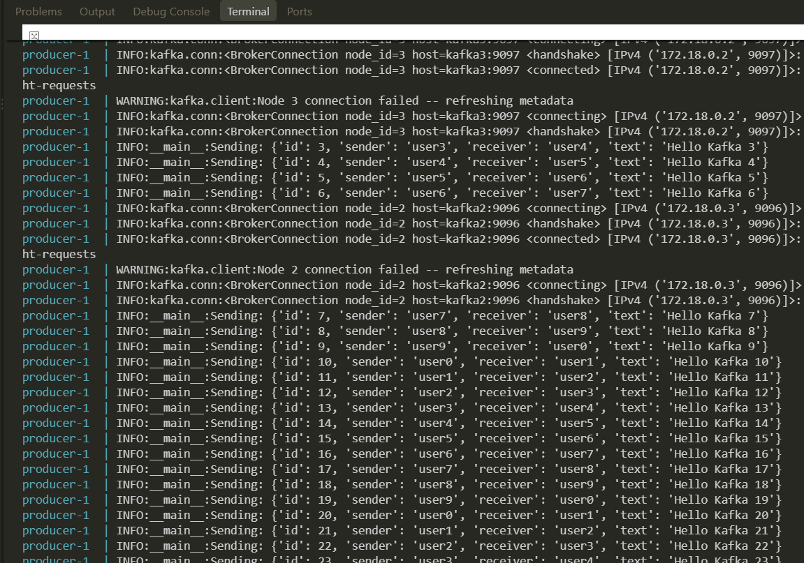

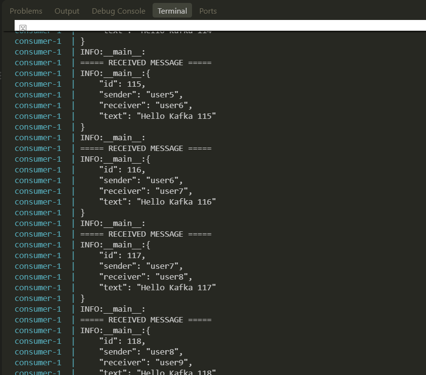

**Негативный тест: консьюмер НЕ может читать topic-2 (только DESCRIBE)**
```bash
docker compose run --rm -e TOPIC=topic-2 consumer python -u consumer.py
# Ожидаемая ошибка:
# kafka.errors.TopicAuthorizationFailedError: [Error 29] TopicAuthorizationFailedError: {'topic-2'}
```
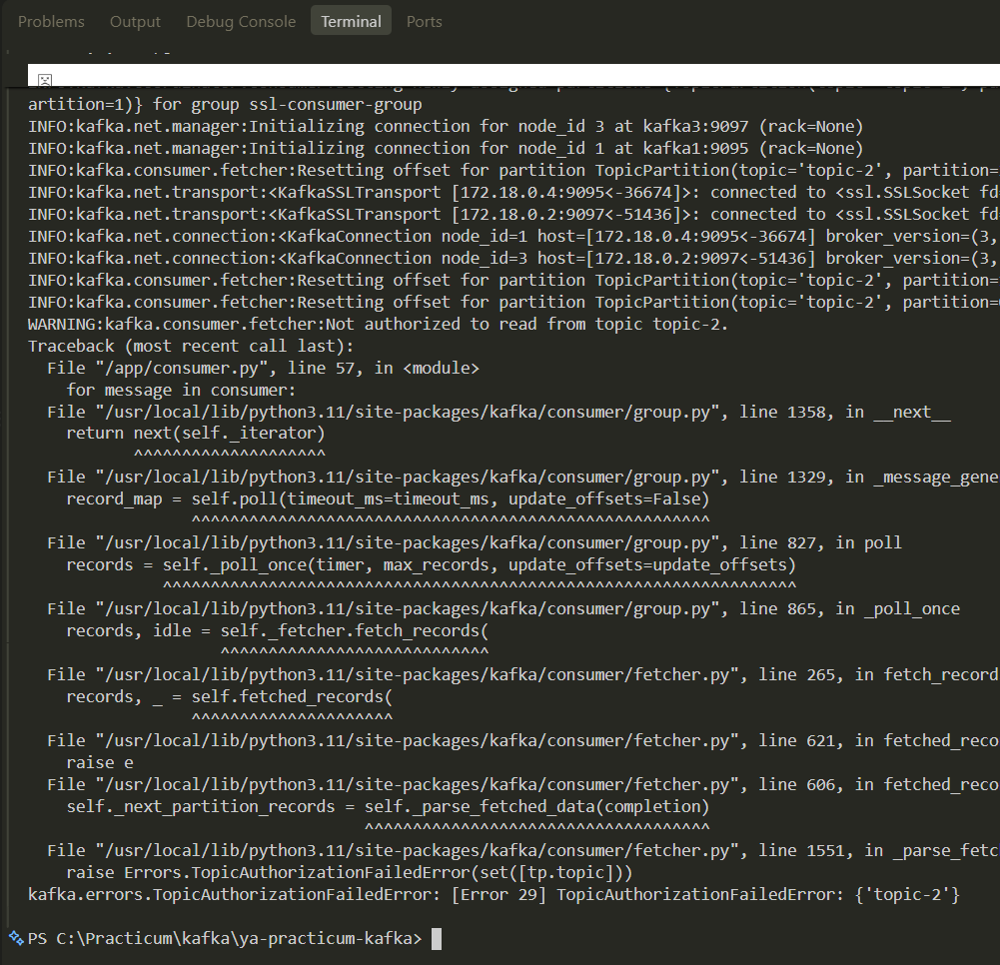

---

## Остановка и перезапуск

```bash
# Остановить (топики/ACL не персистятся, т.к. хранятся внутри контейнеров брокеров)
docker compose down

# Запустить снова (нужно пересоздать топики и ACL)
docker compose up -d --build
docker compose exec kafka1 bash /etc/kafka/ssl-config/create-topics.sh
docker compose exec kafka1 bash /etc/kafka/ssl-config/setup-acls.sh

# Полностью удалить вместе с данными (volumes)
docker compose down -v
```

---

## Запуск на другом компьютере

```bash
git clone https://github.com/kafeev/ya-practicum-kafka.git
cd ya-practicum-kafka

# 1) Собрать и поднять кластер
docker compose up -d --build

# 2) Создать топики
docker compose exec kafka1 bash /etc/kafka/ssl-config/create-topics.sh

# 3) Настроить ACL
docker compose exec kafka1 bash /etc/kafka/ssl-config/setup-acls.sh

# 4) Проверка (см. шаги 4-10 выше)
docker compose logs -f producer
docker compose logs -f consumer
```

Сертификаты, ключи и скрипты уже в репозитории (`ssl/`), отдельной генерации на целевой машине не требуется.

> **Безопасность:** Каталог `ssl/certs/` содержит приватные ключи и пароли хранилищ — убедитесь, что репозиторий приватный. Каталог `temp/` исключён через `.gitignore`.

---

## Схема потока данных (сквозная)

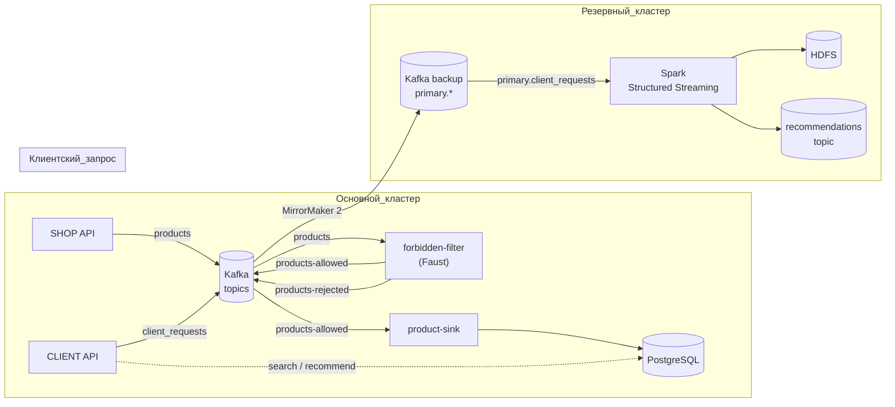
```mermaid
flowchart LR
    subgraph Основной_кластер
        SHOP["SHOP API"]
        FF["forbidden-filter\n(Faust)"]
        PS["product-sink"]
        CA["CLIENT API"]
        K1[("Kafka\ntopics")]
        PG[("PostgreSQL")]

        SHOP -->|"products"| K1
        K1 -->|"products"| FF
        FF -->|"products-allowed"| K1
        FF -->|"products-rejected"| K1
        K1 -->|"products-allowed"| PS
        PS --> PG
    end

    subgraph Резервный_кластер
        BK[("Kafka backup\nprimary.*")]
        SP["Spark\nStructured Streaming"]
        HDFS[("HDFS")]
        REC[("recommendations\ntopic")]
    end

    subgraph Клиентский_запрос
        CA -->|"client_requests"| K1
        CA -.->|"search / recommend"| PG
    end

    K1 -->|"MirrorMaker 2"| BK
    BK -->|"primary.client_requests"| SP
    SP --> HDFS
    SP --> REC
```