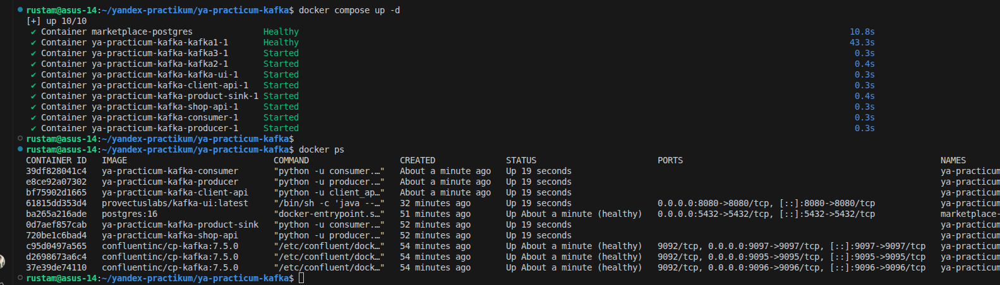
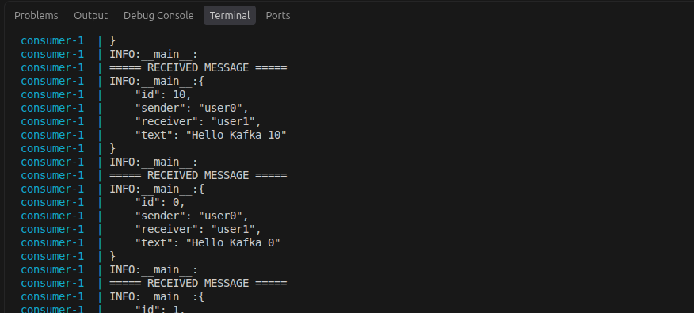
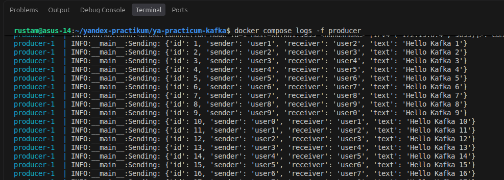
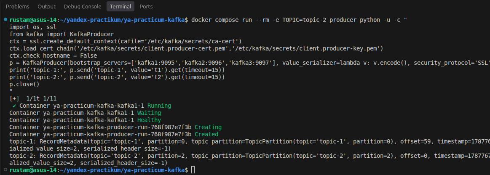
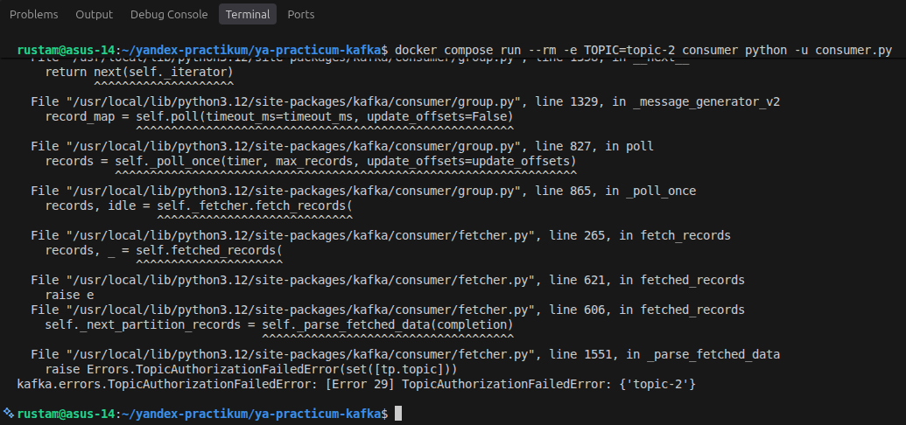
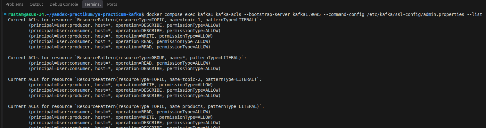
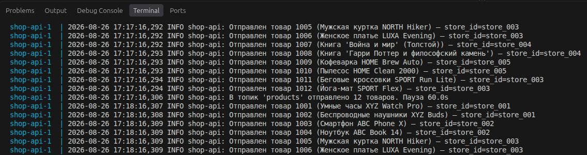
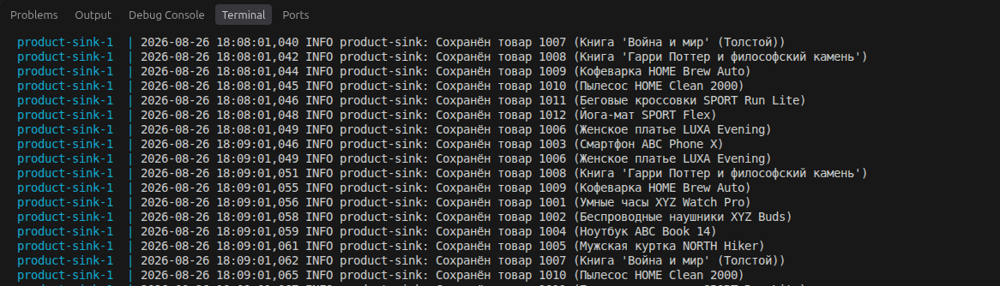
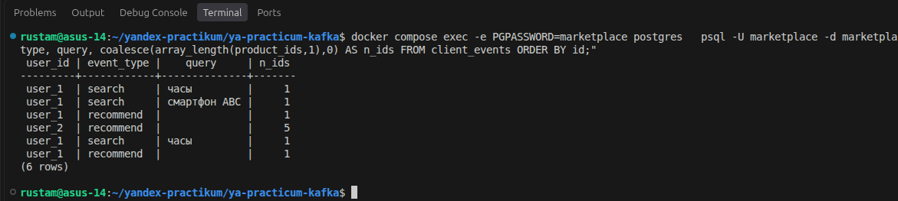

# Kafka-кластер: 3 брокера + SSL + ACL (KRaft)

## Содержание

1. [Архитектура](#1-архитектура)
2. [Структура проекта](#2-структура-проекта)
3. [Предварительные требования](#3-предварительные-требования)
4. [Шаг 1. Генерация сертификатов](#шаг-1-генерация-сертификатов)
5. [Шаг 2. Запуск кластера](#шаг-2-запуск-кластера)
6. [Шаг 3. Создание топиков](#шаг-3-создание-топиков)
7. [Шаг 4. Настройка ACL](#шаг-4-настройка-acl)
8. [Полная последовательность проверки](#шаг-5-полная-последовательность-проверки)
9. [Остановка и перезапуск](#шаг-6-остановка-и-перезапуск)
10. [Запуск на другом компьютере](#шаг-7-запуск-на-другом-компьютере)
11. [Известные особенности и решения](#11-известные-особенности-и-решения)
12. [Аналитическая платформа маркетплейса (Шаг 1)](#12-аналитическая-платформа-маркетплейса-шаг-1)
13. [Шаг 2: отказоустойчивость Kafka](#13-шаг-2-отказоустойчивость-kafka-репликация-mininsyncreplicas-второй-кластер)
14. [Шаг 3: аналитика на Spark (Structured Streaming + HDFS)](#14-шаг-3-аналитика-на-spark-structured-streaming--hdfs)
15. [Шаг 4: потоковая фильтрация запрещённых товаров (Faust)](#15-шаг-4-потоковая-фильтрация-запрещённых-товаров-faust)
16. [Шаг 5: хранение и поиск данных (расширенный вариант, PostgreSQL)](#16-шаг-5-хранение-и-поиск-данных-расширенный-вариант-postgresql)

---

## 1. Архитектура

| Компонент | Описание |
|---|---|
| `kafka1`, `kafka2`, `kafka3` | Брокеры KRaft, роли `broker,controller` |
| Контроллерный кворум | 3 узла (quorum voters) на PLAINTEXT-листенере `9093` |
| SSL-листенер | порты `9095` / `9096` / `9097`, mTLS |
| `producer` | Python-клиент (kafka-python), пишет в `topic-1` |
| `consumer` | Python-клиент (kafka-python), читает из `topic-1` |
| Авторизация | `StandardAuthorizer`, `allow.everyone.if.no.acl.found=false` |

Схема листенеров брокера (например, kafka1):

- `CONTROLLER://0.0.0.0:9093` — внутренний контрольный трафик, PLAINTEXT (только в контейнерной сети);
- `SSL://0.0.0.0:9095` — клиентский и межброкерский трафик, SSL с взаимной аутентификацией.

### Схема прав (ACL)

| Топик | Продюсер (`User:producer`) | Консьюмер (`User:consumer`) |
|---|---|---|
| `topic-1` | DESCRIBE, READ, WRITE | DESCRIBE, READ |
| `topic-2` | DESCRIBE, WRITE | DESCRIBE (читать **не может**) |
| Группа `*` | — | DESCRIBE, READ |

Суперпользователи (`KAFKA_SUPER_USERS`): `User:admin`, `User:kafka1`, `User:kafka2`,
`User:kafka3`, `User:ANONYMOUS`.

---

## 2. Структура проекта

```
.
├── docker-compose.yaml          # кластер (3 брокера) + producer + consumer
├── producer/
│   ├── Dockerfile
│   ├── requirements.txt         # kafka-python==2.0.2
│   └── producer.py              # шлёт JSON-сообщения в топик
├── consumer/
│   ├── Dockerfile
│   └── consumer.py              # читает сообщения из топика
├── ssl/
│   ├── generate-certs.sh        # генерация CA, keystore, truststore, PEM
│   ├── certs/                   # сгенерированные сертификаты
│   └── config/
│       ├── admin.properties     # SSL-конфиг админа для утилит (kafka-acls, ...)
│       ├── producer.properties  # SSL-конфиг клиента-продюсера
│       ├── consumer.properties  # SSL-конфиг клиента-консьюмера
│       ├── create-topics.sh     # создание топиков (отдельный скрипт)
│       └── setup-acls.sh        # настройка ACL (отдельный скрипт)
```

---

## 3. Требования для запуска проекта

- Docker с Docker Compose
- `openssl` и `keytool` (JDK) — только для генерации сертификатов

---

## Шаг 1. Генерация сертификатов

Сертификаты уже сгенерированы и лежат в `ssl/certs/` (каталог игнорируется git).

Если хотчется сгенерировать заново можно запустить скрипт:

```bash
docker run --rm -v ${PWD}/ssl:/ssl -w /ssl confluentinc/cp-kafka:7.5.0 bash generate-certs.sh
```

Скрипт создаёт:

- самоподписанный CA (`ca-cert`, `ca-key`);
- `kafka.truststore.jks` — общий truststore брокеров и клиентов;
- `kafka{1..3}.keystore.jks` — keystore брокеров с SAN `DNS:kafkaN`;
- `client.{producer,consumer,admin}.keystore.jks` — keystore клиентов;
- `client.{producer,consumer,admin}-{cert,key}.pem` — PEM для Python-клиентов.

Пароль всех хранилищ по умолчанию: `kafka123` (он же в `credentials`).

> **Важно.** 
> 
> CN сертификата клиента становится принципалом в ACL.
> 
> Для `client.producer` CN = `producer` → принципал `User:producer`, и т.д.

---

## Шаг 2. Запуск кластера

```bash
docker compose up -d --build
```

Проверка, что все брокеры поднялись и healthy:



Три брокера должны иметь статус `Up ... (healthy)`.

> **Первый запуск / после `down` без `-v`:** топики и ACL хранятся внутри
> контейнеров брокеров и исчезают при удалении контейнеров — после поднятия
> кластера обязательно выполните [Шаг 3](#шаг-3-создание-топиков) и
> [Шаг 4](#шаг-4-настройка-acl). Если `mirror-maker` (зеркалирование, Шаг 2
> платформы) был запущен до создания топиков, перезапустите его, иначе
> зеркальные топики `primary.*` не появятся:
> `docker compose restart mirror-maker`.

---

## Шаг 3. Создание топиков
Так как все скрипты были уже скопированы на брокеры kafka, то можно запускать скрипт создания топиков прямо изнутри.
Можно работать с любой kafa1\kafka2\kafka3:

```bash
docker compose exec kafka1 bash /etc/kafka/ssl-config/create-topics.sh
```

Скрипт создаёт в основном кластере топики `topic-1`, `topic-2`, `products`,
`client_requests` (по 3 партиции, RF=3, `min.insync.replicas=2`), а в резервном
кластере — `recommendations` и `raw_data`. После выполнения выводятся списки
топиков обоих кластеров.

---

## Шаг 4. Настройка ACL
Скрипт для срздания политик доступа (ACL) также скопирован на каждый брокер.

Так что можно запускать на любом:

```bash
docker compose exec kafka1 bash /etc/kafka/ssl-config/setup-acls.sh
```

Скрипт выставляет ACL по схеме из [раздела 1](#1-архитектура) и выводит их список.

Помимо демо-топиков, скрипт также настраивает права платформы маркетплейса:
`User:producer` пишет в `products`/`client_requests`, `User:consumer` читает
`products`, а для аналитики `User:analytics` получает `READ`/`DESCRIBE` на
`primary.client_requests` и `primary.products` и `WRITE`/`DESCRIBE` на
`recommendations` в резервном кластере (см. [Шаг 3, раздел 14](#14-шаг-3-аналитика-на-spark-structured-streaming--hdfs)).

> Оба скрипта монтируются в брокеры из `ssl/config` (каталог `/etc/kafka/ssl-config`).

---

## Шаг 5. Полная последовательность проверки

### 5.0 Проверка автоматических клиентов (topic-1)

Продюсер и консьюмер из `docker-compose` работают с `topic-1` постоянно.

```bash
# продюсер шлёт сообщения каждые 2 секунды
docker compose logs -f producer

# консьюмер их читает (topic-1)
docker compose logs -f consumer
```

В логах консьюмера появляются блоки `===== RECEIVED MESSAGE =====`.



### 5.1 Продюсер пишет в topic-1 и topic-2 (у него READ/WRITE/DESCRIBE на оба)



```bash
docker compose run --rm -e TOPIC=topic-2 producer python -u -c "
import os, ssl
from kafka import KafkaProducer
ctx = ssl.create_default_context(cafile='/etc/kafka/secrets/ca-cert')
ctx.load_cert_chain('/etc/kafka/secrets/client.producer-cert.pem','/etc/kafka/secrets/client.producer-key.pem')
ctx.check_hostname = False
p = KafkaProducer(bootstrap_servers=['kafka1:9095','kafka2:9096','kafka3:9097'], value_serializer=lambda v: v.encode(), security_protocol='SSL', ssl_context=ctx)
print('topic-1:', p.send('topic-1', value='t1').get(timeout=15))
print('topic-2:', p.send('topic-2', value='t2').get(timeout=15))
p.close()
"
```

Оба вызова должны вернуть `RecordMetadata` (успех), т.е. продюсер может писать
и в `topic-1`, и в `topic-2`.


### 5.2 Консьюмер читает topic-1 (у него READ)

Автоматический консьюмер уже читает `topic-1` — см. пункт 5.0.

### 5.3 Консьюмер НЕ может читать topic-2 (только DESCRIBE) — негативный тест

```bash
docker compose run --rm -e TOPIC=topic-2 consumer python -u consumer.py
```

Ожидаемый результат — ошибка:

```
kafka.errors.TopicAuthorizationFailedError: [Error 29] TopicAuthorizationFailedError: {'topic-2'}
```




и в логах `WARNING:...Not authorized to read from topic topic-2.`
Это подтверждает, что на `topic-2` у консьюмера только `DESCRIBE`.

### 5.4 Просмотр текущих ACL

```bash
docker compose exec kafka1 kafka-acls --bootstrap-server kafka1:9095 --command-config /etc/kafka/ssl-config/admin.properties --list
```


---

## Шаг 6. Остановка и перезапуск

Остановить:

```bash
docker compose down
```

Запустить снова (топики/ACL не персистятся):

```bash
docker compose up -d --build
docker compose exec kafka1 bash /etc/kafka/ssl-config/create-topics.sh
docker compose exec kafka1 bash /etc/kafka/ssl-config/setup-acls.sh
```

Полностью удалить вместе с данными:

```bash
docker compose down -v
```

---

## 10. Запуск на другом компьютере

Склонируйте репозиторий и запустите из его корня — весь код, сертификаты
(`ssl/certs/`) и скрипты уже входят в репозиторий:

```bash
git clone https://github.com/kafeev/ya-practicum-kafka.git
cd ya-practicum-kafka

# 1) собрать и поднять кластер
docker compose up -d --build

# 2) создать топики
docker compose exec kafka1 bash /etc/kafka/ssl-config/create-topics.sh

# 3) настроить ACL
docker compose exec kafka1 bash /etc/kafka/ssl-config/setup-acls.sh

# 4) проверка (см. раздел 5)
docker compose logs -f producer
docker compose logs -f consumer
```

Так как сертификаты, ключи и скрипты хранятся в репозитории (`ssl/`),
отдельной генерации на целевой машине не требуется.

---

## 11. Известные особенности и решения

**`AuthorizerNotReadyException` на старте (VOTE/FETCH).**
Контроллерный листенер `CONTROLLER` использует PLAINTEXT, и запросы по нему
идут с принципалом `Anonymous`, а авторизатор ещё «не готов». Решение —
добавить `User:ANONYMOUS` в `KAFKA_SUPER_USERS` и задать
`KAFKA_EARLY_START_LISTENERS: CONTROLLER`.

**Разделитель в `KAFKA_SUPER_USERS` — только `;`.**
`StandardAuthorizer.getConfiguredSuperUsers()` разбивает список по `;`.
Значение через запятую парсится как один принципиал и не работает.

**`[Error 31] ClusterAuthorizationFailedError` у продюсера.**
Идемпотентный продюсер шлёт `InitProducerId`, что требует операцию
`IDEMPOTENT_WRITE` на ресурсе CLUSTER. В стенде kafka-python==2.0.2, которая
идемпотентность не использует, поэтому отдельной CLUSTER-ACL не нужно.

**`KAFKA_AUTO_CREATE_TOPICS_ENABLE: false`.**
Автосоздание топиков выключено, чтобы лишние топики не создавались
неавторизованными клиентами.

**Безопасность секретов.**
Каталог `ssl/certs/` содержит приватные ключи и пароли хранилищ —
убедитесь, что репозиторий (remote) приватный. Каталог `temp/` из git исключён
(`.gitignore`).

---

## 12. Аналитическая платформа маркетплейса (Шаг 1)

Поверх защищённого кластера Kafka (SSL + ACL) реализован первый этап
аналитической платформы: магазины и клиенты взаимодействуют с платформой через
эмуляцию SHOP API и CLIENT API, а данные сохраняются в PostgreSQL и топики Kafka
для последующей аналитики.

### 12.1 Архитектура Шага 1

```
 SHOP API (producer.py)                  CLIENT API (client_api.py)
 читает data/products.json                интерактивный терминал
        |                                       |  |
        | send(JSON)                            |  | search/recommend
        v                                       |  v
   Kafka: products                         Kafka: client_requests   PostgreSQL
        |                                       |        (события       (marketplace)
        v                                       |         запросов)
 product-sink (consumer.py)                     |              ^
        |  upsert                              |              | read products
        v                                       |              | write client_events
   PostgreSQL: products  <----------------------+--------------'
        (таблица products)        поиск/рекомендации читают из БД
```

- **SHOP API** — эмуляция магазина: читает файл `data/products.json` и отправляет
  каждый товар в топик `products` (принципал `User:producer`).
- **product-sink** — консьюмер: читает `products-allowed` (топик, в который
  попадают только разрешённые товары после фильтрации в `forbidden-filter`,
  см. раздел 15) и сохраняет/обновляет записи в таблице `products` PostgreSQL
  (принципал `User:consumer`).
- **CLIENT API** — терминал клиента:
  - `search <user_id> <запрос>` — ищет товары в PostgreSQL (по имени, описанию,
    тегам) и логирует событие в Kafka `client_requests` и в таблицу `client_events`;
  - `recommend <user_id>` — строит персональные рекомендации по истории поисков
    пользователя (бренд/категория/теги), при пустой истории отдаёт популярное;
    событие также уходит в Kafka и `client_events`.
- **Kafka UI** (опционально) — просмотр топиков и сообщений в браузере.

> Параллельно продолжают работать демо-сервисы `producer`/`consumer` из разделов
> 1–11 (пишут/читают `topic-1`). Это демонстрация защищённого кластера и не
> связано с платформой маркетплейса.

### 12.2 Структура добавленных файлов

```
data/products.json          # тестовые товары (12 шт.), под контролем Git
init/01_init.sh             # создание таблиц products и client_events в PostgreSQL
shop_api/                   # SHOP API: producer.py, Dockerfile, requirements.txt
product_sink/               # product-sink: consumer.py, Dockerfile, requirements.txt
client_api/                 # CLIENT API: client_api.py, Dockerfile, requirements.txt
docker-compose.yaml         # добавлены postgres, shop-api, product-sink, client-api
ssl/config/create-topics.sh # добавлены топики products и client_requests
ssl/config/setup-acls.sh    # добавлены ACL для products и client_requests
```

### 12.3 Запуск проекта

```bash
# 1) Поднять защищённый кластер Kafka (3 брокера, SSL + ACL)
docker compose up -d kafka1 kafka2 kafka3

# 2) Дождаться статуса healthy (опционально проверить)
docker compose ps

# 3) Создать топики (в т.ч. products и client_requests)
docker compose exec kafka1 bash /etc/kafka/ssl-config/create-topics.sh

# 4) Настроить ACL (продюсер/консьюмер для новых топиков)
docker compose exec kafka1 bash /etc/kafka/ssl-config/setup-acls.sh

# 5) Поднять PostgreSQL и сервисы платформы
docker compose up -d postgres product-sink shop-api

# 6) Запуск интерактивного терминала CLIENT API
docker compose run -it client-api
```

### 12.4 Проверка, что всё работает

#### А. SHOP API → Kafka → product-sink → PostgreSQL

Убедиться, что товары дошли до базы:

```bash
docker compose exec -e PGPASSWORD=marketplace postgres \
  psql -U marketplace -d marketplace -c "SELECT count(*) FROM products;"
# ожидаем: 12
```

Логи эмуляции магазина и сохранения:

```bash
docker compose logs -f shop-api       # "Отправлен товар 1001 ..." каждые SEND_INTERVAL
docker compose logs -f product-sink   # "Сохранён товар 1001 ..."
```


```bash
docker compose logs -f product-sink   # "Сохранён товар 1001 ..."
```


#### Б. Проверка топиков через утилиты (вместо Kafka UI, который был опционален и удалён)

Список топиков основного кластера:

```bash
docker compose exec kafka1 kafka-topics \
  --bootstrap-server kafka1:9095 --command-config /etc/kafka/ssl-config/admin.properties \
  --list
# ожидаем: topic-1, topic-2, products, client_requests (+ служебные __consumer_offsets, mm2-*)
```

Прочитать сообщения из топика (аналог «просмотра в UI»):

```bash
docker compose exec kafka1 kafka-console-consumer \
  --bootstrap-server kafka1:9095 --consumer.config /etc/kafka/ssl-config/admin.properties \
  --topic products --from-beginning --max-messages 5 --timeout-ms 8000
```

#### В. CLIENT API: поиск и рекомендации

В терминале `client-api` (п. 12.3, шаг 7):

```
client> search user_1 часы
client> search user_1 смартфон ABC
client> recommend user_1
client> recommend user_2
client> help
client> exit
```

Ожидаемый результат:
- `search user_1 часы` → найдёт «Умные часы XYZ Watch Pro»;
- `recommend user_1` → персональная рекомендация по истории (напр. «Ноутбук ABC Book 14» по бренду ABC);
- `recommend user_2` (без истории) → популярные товары.

Неинтерактивная проверка (удобно для CI/проверяющего):

```bash
printf 'search user_1 часы\nrecommend user_1\nexit\n' | docker compose run --rm -T client-api
```

#### Г. События клиентов в Kafka и в БД

События запросов пишутся в топик `client_requests` (для аналитики) и в таблицу
`client_events` (PostgreSQL):

```bash
# прочитать события из Kafka (через admin-клиент)
docker compose exec kafka1 kafka-console-consumer \
  --bootstrap-server kafka1:9095 \
  --consumer.config /etc/kafka/ssl-config/admin.properties \
  --topic client_requests --from-beginning --max-messages 5 --timeout-ms 8000

# проверить записи в БД
docker compose exec -e PGPASSWORD=marketplace postgres \
  psql -U marketplace -d marketplace \
  -c "SELECT user_id, event_type, query, coalesce(array_length(product_ids,1),0) AS n_ids FROM client_events ORDER BY id;"
```


### 12.5 Полезные команды

```bash
# пересоздать всё с данными (полный сброс)
docker compose down -v
docker compose up -d kafka1 kafka2 kafka3
docker compose exec kafka1 bash /etc/kafka/ssl-config/create-topics.sh
docker compose exec kafka1 bash /etc/kafka/ssl-config/setup-acls.sh
docker compose up -d postgres product-sink shop-api

# остановить только сервисы платформы (кластер оставить)
docker compose stop postgres product-sink shop-api client-api
```

> Пароль PostgreSQL (пользователь `marketplace`, БД `marketplace`) — `marketplace`.
> Сертификаты клиентов Kafka лежат в `ssl/certs/` (см. раздел 11 про секреты).

---

## 13. Шаг 2: отказоустойчивость Kafka (репликация, min.insync.replicas, второй кластер)

Поверх защищённого кластера из разделов 1–12 реализована отказоустойчивость.

### 13.1 Что сделано

| Требование Шага 2 | Реализация |
|---|---|
| Кластер Kafka | 3 брокера `kafka1/2/3` (KRaft, см. раздел 1) |
| Передача данных через TLS | SSL-листенеры `9095/9096/9097`, межброкерский SSL, mTLS (раздел 1) |
| Необходимые топики | `products`, `client_requests` (+ `topic-1/2`) — `ssl/config/create-topics.sh` |
| ACL для защиты топиков | `StandardAuthorizer`, `ALLOW_EVERYONE_IF_NO_ACL_FOUND=false` — `ssl/config/setup-acls.sh` |
| Репликация для отказоустойчивости | Все топики `ReplicationFactor=3`, `min.insync.replicas=2` |
| Дублирование на второй кластер | Резервный кластер `backup1/2/3` + MirrorMaker 2 (`mirror-maker`) |

### 13.2 min.insync.replicas

Задано двумя способами (на случай пересоздания топиков):

- на уровне брокеров — `KAFKA_MIN_INSYNC_REPLICAS: 2` в `docker-compose.yaml` (все `kafka1/2/3`);
- на уровне топиков — флаг `--config min.insync.replicas=2` в `ssl/config/create-topics.sh`.

Проверка:

```bash
docker compose exec kafka1 kafka-topics \
  --bootstrap-server kafka1:9095 --command-config /etc/kafka/ssl-config/admin.properties \
  --describe --topic products
# Configs: min.insync.replicas=2, ReplicationFactor: 3
```

### 13.3 Второй (резервный) кластер

Сервисы `backup1/backup2/backup3` — отдельный KRaft-кластер (свой `CLUSTER_ID`,
порты SSL `9195/9196/9197`, контроллерный `9193`). TLS настроен переиспользованием
сертификатов `kafka{1..3}` (поэтому `KAFKA_SSL_ENDPOINT_IDENTIFICATION_ALGORITHM=""`
на резервных брокерах отключает проверку имени хоста). `User:admin` — суперпользователь
в обоих кластерах, что позволяет MirrorMaker 2 читать/писать без доп. ACL.

### 13.4 MirrorMaker 2 (зеркалирование)

Сервис `mirror-maker` запускает `org.apache.kafka.connect.mirror.MirrorMaker` с
конфигом `mm2/mm2.properties`. Реплицируются топики `products` и `client_requests`
из основного кластера (`primary`) в резервный (`backup`):

```
primary (kafka1:9095)  --MM2-->  backup (backup1:9195)
   products        ->  primary.products
   client_requests ->  primary.client_requests
```

### 13.5 Запуск всего стенда

```bash
# основной кластер + топики/ACL
docker compose up -d kafka1 kafka2 kafka3
docker compose exec kafka1 bash /etc/kafka/ssl-config/create-topics.sh
docker compose exec kafka1 bash /etc/kafka/ssl-config/setup-acls.sh

# платформа + резервный кластер + зеркалирование + аналитика
docker compose up -d postgres product-sink shop-api
docker compose up -d backup1 backup2 backup3
docker compose up -d mirror-maker
docker compose up -d spark-analytics
```

> Если все сервисы поднимаются одной командой (`docker compose up -d --build`),
> `mirror-maker` может стартовать до создания топиков на шаге 3 и не создать
> зеркальные топики `primary.*`. В этом случае перезапустите его после шага 3:
> `docker compose restart mirror-maker`. Аналитика (`spark-analytics`) ждёт
> появления `primary.client_requests` и сама возобновит работу после рестарта.

### 13.6 Проверка зеркалирования

Убедиться, что топики появились в резервном кластере (префикс `primary.`):

```bash
docker compose exec backup1 kafka-topics \
  --bootstrap-server localhost:9195 --command-config /etc/kafka/ssl-config/admin-backup.properties \
  --list
# primary.products, primary.client_requests, heartbeats, mm2-*
```

Считать сообщения из резервного кластера (данные продублированы):

```bash
docker compose exec backup1 kafka-console-consumer \
  --bootstrap-server localhost:9195 --consumer.config /etc/kafka/ssl-config/admin-backup.properties \
  --topic primary.products --from-beginning --max-messages 12 --timeout-ms 8000
```

Живая проверка: выполните `search` в CLIENT API — через несколько секунд
сообщение появится в `primary.client_requests` резервного кластера.

> Failover: при падении основного кластера приложения могут переключиться на
> `backup1:9195/backup2:9196/backup3:9197` (топики там доступны под именами
> `primary.*`). Для автоматического переключения продюсеры/консьюмеры должны
> указывать оба кластера в `bootstrap.servers`.

---

## 14. Шаг 3: аналитика на Spark (Structured Streaming + HDFS)

Поверх данных, зеркалированных в резервный кластер (`primary.client_requests`),
работает Spark-приложение `spark-analytics`, реализующее базовую аналитику
маркетплейса в реальном времени.

### 14.1 Что делает сервис

- читает события запросов клиентов из топика `primary.client_requests` резервного
  кластера (`backup1:9195`, SSL + принципал `User:analytics`);
- в каждом микро-батче сохраняет «сырые» события в HDFS
  (`hdfs://hdfs-namenode:8020/user/spark/raw`, формат JSON, режим `append`);
- вычисляет ТОП-10 популярных поисковых запросов (`type=search`) за батч и
  публикует их в топик `recommendations` резервного кластера (событие
  `popular_search` с полем `generated_at` в UTC).

Код приложения — `spark-analytics/analytics.py`, образ собирается из
`spark-analytics/Dockerfile` (базовый `spark:3.5.1`). Все нужные jar-файлы
(`spark-sql-kafka`, `kafka-clients`, клиент Hadoop и зависимости) предзагружаются
в образ на этапе сборки, поэтому в рантайме `--packages` не требуется и приложение
стартует в офлайн-среде. `requirements.txt` намеренно пуст (pyspark уже в базовом
образе, отдельный `py4j`/kafka-python не нужны и могут сломать импорт).

### 14.2 Конфигурация и чекпоинты

- Точка выхода стрима (`checkpointLocation`) — `/opt/spark/checkpoint-spark-analytics`
  внутри контейнера, **смонтирована в именованный volume
  `spark-analytics-checkpoint`** в `docker-compose.yaml`. Благодаря персистентному
  чекпоинту при перезапуске контейнера (`restart: on-failure`) стрим возобновляется
  с последнего сохранённого смещения, а не с `earliest`. Это предотвращает
  повторную запись уже обработанных событий в HDFS при сбоях.
- `startingOffsets=earliest` задаётся только для первого (холодного) старта, пока
  чекпоинта ещё нет.
- На чтении Kafka установлен `failOnDataLoss=false`: топики не персистятся между
  `docker compose down`/`up` и могут быть пересозданы с оффсетами сброшенными в 0,
  что иначе привело бы к падению стрима из-за расхождения с сохранённым чекпоинтом.
  С этим флагом Spark просто перечитывает топик с начала после пересоздания.

### 14.3 Запуск

Сервис `spark-analytics` поднимается вместе со всем стендом
(`docker compose up -d --build`) либо отдельно:

```bash
docker compose up -d spark-analytics
```

Перед запуском должны быть выполнены [Шаг 3](#шаг-3-создание-топиков) и
[Шаг 4](#шаг-4-настройка-acl), а топик `primary.client_requests` — существовать
в резервном кластере (его создаёт MirrorMaker 2, см. раздел 13). Сам сервис
стартует и ждёт появления топика, поэтому порядок запуска некритичен.

### 14.4 Проверка

Логи обработки микро-батчей:

```bash
docker compose logs -f spark-analytics
# [batch N] raw data landed to HDFS (hdfs://hdfs-namenode:8020/user/spark/raw)
# [batch N] recommendations written to topic 'recommendations'
```

Прочитать рекомендации из резервного кластера:

```bash
docker compose exec backup1 kafka-console-consumer \
  --bootstrap-server localhost:9195 --consumer.config /etc/kafka/ssl-config/admin-backup.properties \
  --topic recommendations --from-beginning --max-messages 10 --timeout-ms 8000
```

Убедиться, что «сырые» данные попали в HDFS:

```bash
docker compose exec hdfs-namenode hdfs dfs -ls /user/spark/raw
```

Минимальная проверка сквозного пути — отправить поисковые запросы через
CLIENT API (раздел 12.3, шаг 7 / 12.4.В); через несколько секунд Spark выдаст
соответствующие рекомендации в топик `recommendations`.

## 15. Шаг 4: потоковая фильтрация запрещённых товаров (Faust)

### 15.1 Что делает сервис

`forbidden-filter` — это сервис потоковой обработки на **Faust** (Python-аналог
Kafka Streams). Он реализует требование «извлечь товары из топика и
отфильтровать запрещённые»:

- читает товары из топика `products` (основной кластер);
- сверяет `product_id` каждого товара со **списком запрещённых**;
- разрешённые товары (`product_id` нет в списке) отправляет в `products-allowed`;
- запрещённые товары отправляет в `products-rejected` (топик видимости/логов);
- `product-sink` читает теперь **`products-allowed`** (см. раздел 12) и кладёт
  разрешённые товары в PostgreSQL. Запрещённые товары в БД не попадают.

Источник истины для списка запрещённых — компактный топик `forbidden-products`.
Сервис держит словарь запрещённых в памяти, проигрывая `forbidden-products` с
начала (`auto_offset_reset=earliest`) при старте; добавление/удаление товара из
списка публикуется туда же через CLI (см. 15.4), поэтому список актуален без
перезапуска сервиса.

> Почему Faust: из трёх вариантов (Kafka Streams / Faust / Goka) только Faust —
> экосистема Python, совместимая с остальным кодом стенда.

### 15.2 Топики и ACL

Новые топики (создаются в `ssl/config/create-topics.sh`):

| Топик | Назначение | Параметры |
|-------|-----------|-----------|
| `forbidden-products` | список запрещённых (compacted) | RF=3, `cleanup.policy=compact` |
| `products-allowed` | разрешённые товары → `product-sink` | RF=3 |
| `products-rejected` | отклонённые товары (лог/видимость) | RF=3 |

Права (добавлены в `ssl/config/setup-acls.sh`, применяются `setup-acls.sh`):

- `User:producer` (с этим же принципалом работает Faust, т.к. он пишет и
  читает служебные топики): `READ/WRITE/DESCRIBE` на `products`,
  `forbidden-products`, `products-allowed`, `products-rejected`; `ALL` на
  префикс `forbidden-filter-` (внутренние топики Faust: assignor/reply);
  `Create` и `Describe` на **CLUSTER** (нужны, чтобы Faust мог создавать
  внутренние топики и выполнять `FindCoordinator` для группы консьюмера);
- `User:producer` также выданы `READ/DESCRIBE` на группы `forbidden-filter`,
  `forbidden-filter-*` и `forbidden-cli-list` (без права на группу
  `FindCoordinator` падает с `GROUP_AUTHORIZATION_FAILED`, error 30);
- `User:consumer` (`product-sink`): `READ/DESCRIBE` на `products-allowed`.

### 15.3 Конфигурация

Сервис описан в `docker-compose.yaml` (образ собирается из `./forbidden_filter`).
Ключевые переменные окружения:

| Переменная | Значение по умолчанию | Назначение |
|-----------|----------------------|-----------|
| `BOOTSTRAP_SERVERS` | `kafka1:9095,kafka2:9096,kafka3:9097` | брокеры основного кластера |
| `SSL_CAFILE` / `SSL_CERTFILE` / `SSL_KEYFILE` | клиентские сертификаты `client.producer` | TLS для продюсера/консьюмера |
| `SSL_CHECK_HOSTNAME` | `false` | отключение проверки имени хоста |
| `PRODUCTS_TOPIC` / `FORBIDDEN_TOPIC` / `ALLOWED_TOPIC` / `REJECTED_TOPIC` | `products` / `forbidden-products` / `products-allowed` / `products-rejected` | имена топиков |

Важные детали реализации (`forbidden_filter/faust_app.py`):

- `broker` передаётся **списком** URL (`[kafka://kafka1:9095, ...]`). Если
  передать строку с несколькими хостами, внутренний клиент aiokafka откатывается
  на `127.0.0.1:9092` и не читает данные;
- `broker_credentials=SSLCredentials(ssl_context)` включает TLS для продюсера и
  консьюмера;
- `failOnDataLoss` не применим (Faust сам ведёт оффсеты), но чекпоинтов нет —
  состояние списка восстанавливается реплейем `forbidden-products` с начала.

### 15.4 Запуск и управление списком запрещённых

Сервис поднимается вместе со стендом (`docker compose up -d --build`) либо
отдельно:

```bash
docker compose up -d forbidden-filter
```

Управление списком запрещённых — через CLI (`forbidden_filter/cli.py`,
использует те же `client.producer`-сертификаты, пишет в `forbidden-products`):

```bash
# добавить товар в запрещённые
docker compose run --rm forbidden-filter python cli.py add 1005 \
  --name "Мужская куртка NORTH Hiker" --reason "запрещён к продаже"

# удалить из запрещённых (tombstone в компактном топике)
docker compose run --rm forbidden-filter python cli.py remove 1005

# показать текущий список (читает forbidden-products с начала)
docker compose run --rm forbidden-filter python cli.py list
```

### 15.5 Проверка

1. Добавить товар в запрещённые: `cli.py add 1005 ...`.
2. Дождаться следующего цикла SHOP API (раз в ~60 c) и проверить логи фильтра:

   ```bash
   docker compose logs -f forbidden-filter
   # ОТКЛОНЁН товар 1005 (...) — в списке запрещённых
   # ПРОПУЩЕН товар 1001 (...)
   ```

3. Запрещённый товар попадает в `products-rejected`, но НЕ в `products-allowed`:

   ```bash
   docker compose exec kafka1 kafka-console-consumer \
     --bootstrap-server kafka1:9095 --consumer.config /etc/kafka/ssl-config/admin.properties \
     --topic products-rejected --from-beginning --max-messages 5 --timeout-ms 8000
   # product_id=1005 присутствует

   docker compose exec kafka1 kafka-console-consumer \
     --bootstrap-server kafka1:9095 --consumer.config /etc/kafka/ssl-config/admin.properties \
     --topic products-allowed --from-beginning --max-messages 60 --timeout-ms 8000 | grep -c 1005
   # 0 — 1005 отфильтрован
   ```

4. Удалить из запрещённых: `cli.py remove 1005` → в следующем цикле товар
   снова появится в `products-allowed` и в PostgreSQL (`marketplace.postgres`,
   таблица `products`).

> Примечание: `product-sink` теперь читает `products-allowed` (а не `products`),
> поэтому запрещённые товары физически не доходят до БД.

## 16. Шаг 5: хранение и поиск данных (расширенный вариант, PostgreSQL)

### 16.1 Что реализовано

Выбран **расширенный вариант** — хранение и поиск на существующем инстансе
PostgreSQL (без Kafka Connect и без отдельного хранилища):

- **Хранение.** Отфильтрованные товары попадают в PostgreSQL: сервис
  `product-sink` читает топик `products-allowed` (результат фильтрации Faust,
  см. раздел 15) и выполняет upsert в таблицу `products`. Таким образом в БД —
  только разрешённые товары; запрещённые (топик `products-rejected`) в БД не
  попадают. Это удовлетворяет требованию «в хранилище попадают только
  отфильтрованные данные».
- **Поиск.** Полнотекстовый поиск на стороне PostgreSQL: колонка
  `search_vector` (тип `tsvector`) + GIN-индекс + триггер, который
  пересчитывает вектор при каждой записи. Поиск ранжируется по релевантности
  (`ts_rank`). Клиентский поиск выполняется командой `search` в `client-api`.

> Базовый вариант (запись отфильтрованных данных в файл через Kafka Connect)
> здесь не используется, так как выбран расширенный вариант на PostgreSQL.

### 16.2 Схема поиска

Создаётся скриптом инициализации `init/01_init.sh` (идемпотентно, применяется
при первом подъёме БД) и может быть применена к уже работающей БД отдельной
миграцией:

```sql
ALTER TABLE products ADD COLUMN IF NOT EXISTS search_vector tsvector;
CREATE INDEX IF NOT EXISTS idx_products_search ON products USING gin (search_vector);

CREATE OR REPLACE FUNCTION products_search_vector_update() RETURNS trigger AS $$
BEGIN
  NEW.search_vector :=
      setweight(to_tsvector('russian', coalesce(NEW.name, '')), 'A') ||
      setweight(to_tsvector('russian', coalesce(NEW.brand, '')), 'A') ||
      setweight(to_tsvector('russian', coalesce(NEW.category, '')), 'B') ||
      setweight(to_tsvector('russian', coalesce(NEW.description, '')), 'C') ||
      setweight(to_tsvector('russian', coalesce(NEW.tags::text, '')), 'C');
  RETURN NEW;
END;
$$ LANGUAGE plpgsql;

DROP TRIGGER IF EXISTS trg_products_search_vector ON products;
CREATE TRIGGER trg_products_search_vector
  BEFORE INSERT OR UPDATE ON products
  FOR EACH ROW EXECUTE FUNCTION products_search_vector_update();
```

Веса: имя/бренд — `A`, категория — `B`, описание/теги — `C`. Конфигурация
полнотекстового поиска — `'russian'` (снежинка-стеммер для русского; латинские
бренды индексируются как есть).

### 16.3 Поиск из client-api

Команда `search <user_id> <запрос>` в `client_api` выполняет:

```sql
SELECT product_id, name, brand, category, price_amount, price_currency, stock_available
FROM products, websearch_to_tsquery('russian', %s) q
WHERE search_vector @@ q
ORDER BY ts_rank(search_vector, q) DESC
LIMIT 20;
```

При пустом результате или ошибке парсинга запроса выполняется запасной
подстроковый поиск (`ILIKE` по имени/описанию/тегам) — для частичных слов и
нестандартных запросов. Каждый поиск логируется в `client_events` и в топик
`client_requests` (для аналитики Spark, раздел 14).

### 16.4 Проверка

На уровне SQL (топик `products-allowed` уже наполнен product-sink):

```bash
docker exec -i marketplace-postgres psql -U marketplace -d marketplace -c \
  "SELECT product_id, name FROM products, websearch_to_tsquery('russian','часы') q \
   WHERE search_vector @@ q ORDER BY ts_rank(search_vector,q) DESC LIMIT 3;"
# 1001 | Умные часы XYZ Watch Pro
```

Через клиентский интерфейс:

```bash
docker compose run --rm client-api
# search user_1 часы
#   Найдено товаров: 1
#     [1001] Умные часы XYZ Watch Pro | XYZ | Электроника | 4999.99 RUB | на складе: 150
# search user_1 NORTH      -> 1005 (Мужская куртка NORTH Hiker)
# search user_1 куртка     -> 1005
```

Убедиться, что в БД — только отфильтрованные товары (нет запрещённых, если
список запрещённых не пуст):

```bash
docker exec -i marketplace-postgres psql -U marketplace -d marketplace -tAc \
  "SELECT count(*) FROM products;"
```