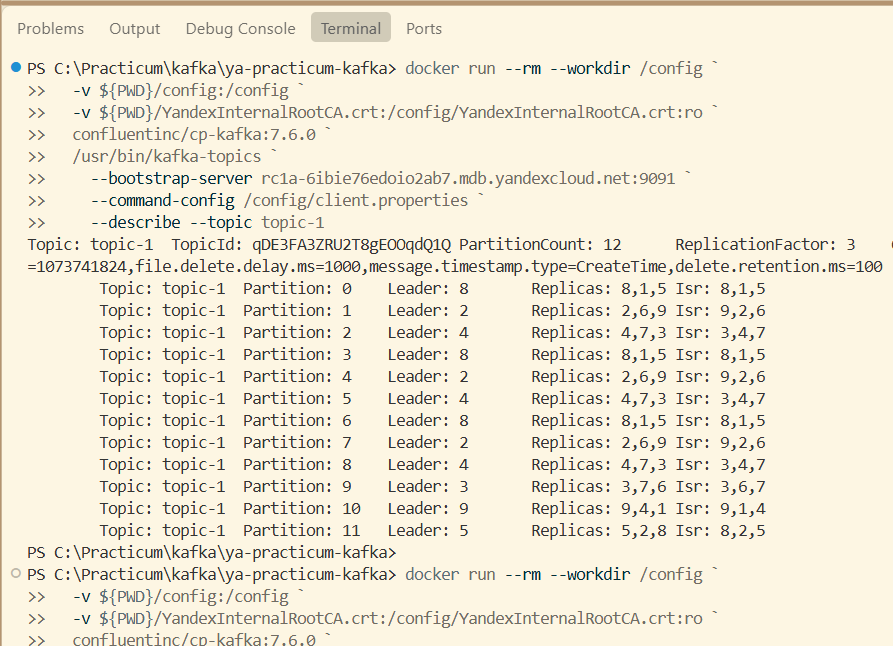
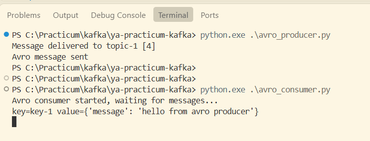
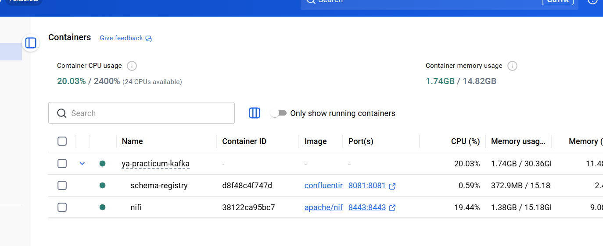
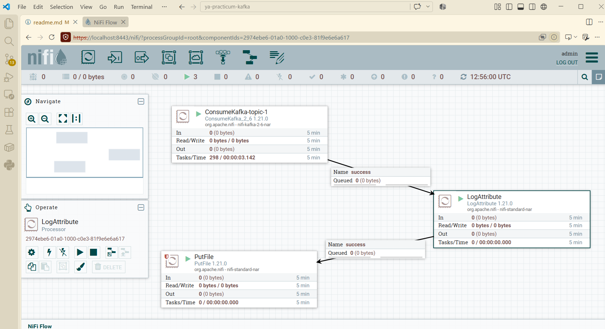
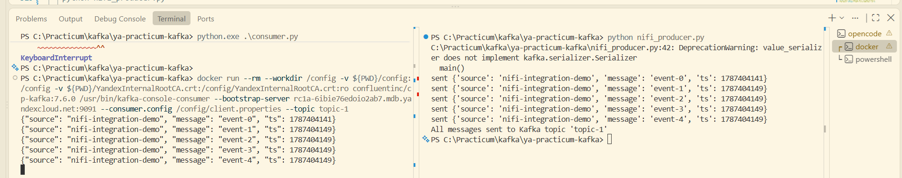
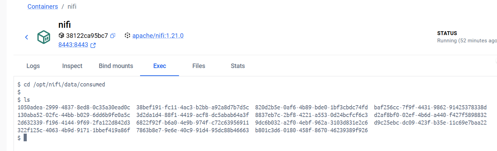

# Задание 1. Развёртывание и настройка Kafka-кластера в Yandex Cloud


## 0. Общая информация о кластере

| Параметр | Значение |
| --- | --- |
| Сервис | Yandex Managed Service for Apache Kafka® |
| Хост брокера | `rc1a-6ibie76edoio2ab7.mdb.yandexcloud.net` |
| Порт | `9091` (внешний SSL-эндпоинт) |
| Протокол безопасности | `SASL_SSL` |
| Механизм аутентификации | `SCRAM-SHA-512` |
| Пользователь | `practicumuser` |
| Количество брокеров | 3 |
| Корневой CA-сертификат | `YandexInternalRootCA.crt` (в корне репозитория) |

Используемый топик: **`topic-1`**.

Клиентское подключение (Python) реализовано в `producer.py` и `consumer.py`
(библиотека `kafka-python`, см. `requirements.txt`).

---

## Шаг 1. Развёртывание Kafka

Кластер развёрнут в Yandex Cloud через Managed Service for Apache Kafka® с
**3 брокерами** в разных зонах доступности для отказоустойчивости.


### Параметры кластера

- `default.replication.factor = 3` — репликация по умолчанию равна числу брокеров.
- `min.insync.replicas = 2` — запись подтверждается после синхронизации с 2 репликами (допускает отказ 1 брокера без потери данных).
- `num.partitions = 3` — число партиций по умолчанию.
- `auto.create.topics.enable = false` — топики создаются явно.

## Шаг 2. Настройка репликации и хранения данных

### Создание топика


### Вывод `kafka-topics.sh --describe`

Запускал через docker образ




> Команда выполняется из Docker-образа `confluentinc/cp-kafka:7.6.0`
> (утилита `kafka-topics` там лежит по пути `/usr/bin/kafka-topics`):
>
> ```bash
> docker run --rm --workdir /config \
>   -v ${PWD}/config:/config \
>   -v ${PWD}/YandexInternalRootCA.crt:/config/YandexInternalRootCA.crt:ro \
>   confluentinc/cp-kafka:7.6.0 \
>   /usr/bin/kafka-topics \
>     --bootstrap-server rc1a-6ibie76edoio2ab7.mdb.yandexcloud.net:9091 \
>     --command-config /config/client.properties \
>     --describe --topic topic-1
> ```
>
> Фактический скриншот вывода: `picts/topic-all-messages.png`
> (либо добавьте отдельный `picts/topic-describe.png`).

---

## Шаг 3. Настройка Schema Registry

Confluent Schema Registry развёрнут локально в Docker и доступен по
`http://localhost:8081`.

### Подготовка в Yandex Cloud (один раз)

Confluent Schema Registry хранит схемы в служебном топике `_schemas`. Его
нужно создать заранее и выдать права пользователю `registry`. Команды —
в `scripts/setup-registry.sh` (нужны утилита `yc` и переменные
`CLUSTER_ID`, `REGISTRY_PASSWORD`):

```bash
# 1) создать пользователя registry
yc managed-kafka user create <CLUSTER_ID> --name registry --password <REGISTRY_PASSWORD>

# 2) создать топик _schemas (1 партиция, политика compact)
yc managed-kafka topic create <CLUSTER_ID> --name _schemas \
  --partitions 1 --replication-factor 3 --cleanup-policy CLEANUP_POLICY_COMPACT

# 3) выдать registry права ACCESS_ROLE_PRODUCER и ACCESS_ROLE_CONSUMER на _schemas
yc managed-kafka topic grant-permission <CLUSTER_ID> --topic-name _schemas --user-name registry --role ACCESS_ROLE_PRODUCER
yc managed-kafka topic grant-permission <CLUSTER_ID> --topic-name _schemas --user-name registry --role ACCESS_ROLE_CONSUMER
```

`<CLUSTER_ID>` получить командой `yc managed-kafka cluster list`.
Пароль `<REGISTRY_PASSWORD>` должен совпадать с тем, что указан в
`docker-compose.schema-registry.yml`.


### Развёртывание локально через Docker

Используется `docker-compose.schema-registry.yml` (образ
`confluentinc/cp-schema-registry:7.6.0`). Schema Registry подключается к
кластеру Yandex по `SASL_SSL`/`SCRAM-SHA-512` от имени пользователя `registry`
и хранит схемы в `_schemas`.


```bash
docker compose -f docker-compose.schema-registry.yml up -d

# проверка доступности
curl http://localhost:8081/
```

вывод
```bash
PS C:\Practicum\kafka\ya-practicum-kafka> curl http://localhost:8081/

Предупреждение безопасности: риск выполнения сценария                                                                                                                                                                                                      
Invoke-WebRequest анализирует содержимое веб-страницы. При анализе страницы может выполняться код сценария на веб-странице.                                                                                                                                
      РЕКОМЕНДУЕМОЕ ДЕЙСТВИЕ:                                                                                                                                                                                                                              
      Используйте параметр -UseBasicParsing, чтобы предотвратить выполнение кода сценария.                                                                                                                                                                 

      Продолжить?
    
[Y] Да - Y  [A] Да для всех - A  [N] Нет - N  [L] Нет для всех - L  [S] Приостановить - S  [?] Справка (значением по умолчанию является "N"): y


StatusCode        : 200
StatusDescription : OK
Content           : {123, 125}
RawContent        : HTTP/1.1 200 OK
                    X-Request-ID: 87416d16-63c4-4210-a984-17913479d5dc
                    Vary: Accept-Encoding, User-Agent
                    Content-Length: 2
                    Content-Type: application/vnd.schemaregistry.v1+json
                    Date: Sat, 22 Aug 2026 ...
Headers           : {[X-Request-ID, 87416d16-63c4-4210-a984-17913479d5dc], [Vary, Accept-Encoding, User-Agent], [Content-Length, 2], [Content-Type, application/vnd.schemaregistry.v1+json]...}
RawContentLength  : 2
```

Настройки подключения (bootstrap, SASL, CA, пароль `registry`) лежат в
`schema-registry.custom.properties`. CA-сертификат Yandex монтируется в
контейнер как `/etc/schema-registry/YandexInternalRootCA.crt` (PEM truststore).

Если группа `schema-registry` в кластере «зависла» из-за другого SR, её можно
сбросить скриптом `scripts/reset_sr_group.py` (Kafka Admin API).

### Файл схемы

Схема данных (Avro) — файл **`schema.avsc`** (соответствует сообщению продюсера
`{"message": "..."}`):

```json
{
  "type": "record",
  "name": "Message",
  "namespace": "practicum.kafka",
  "fields": [ { "name": "message", "type": "string" } ]
}
```

### Регистрация схемы

Схема регистрируется **автоматически** при первой отправке Avro-сообщения
продюсером `avro_producer.py` (субъект значения — `topic-1-value`, ключа —
`topic-1-key`). Файл схемы — `schema.avsc`. Зарегистрировать схему вручную
также можно скриптом `scripts/register-schema.sh`.

> **Совместимость клиента:** в свежих версиях `confluent-kafka` (2.x)
> Schema Registry-клиент использует `httpx`, который некорректно работает с
> Jetty в Schema Registry 7.6.0 (все запросы возвращают HTTP 503). Для
> обхода модуль `sr_http.py` подменяет HTTP-транспорт клиента на `requests`
> (который работает корректно). `avro_producer.py` и `avro_consumer.py`
> импортируют `sr_http` первой строкой.

### Проверка регистрации схем



Проверить ответы Schema Registry:
```bash
curl http://localhost:8081/subjects
# ["topic-1-value"]

curl -X GET http://localhost:8081/subjects/topic-1-value/versions
# [1]
```


## Шаг 4. Проверка работы Kafka


Подключается по `SASL_SSL`/`SCRAM-SHA-512`, отправляет одно сообщение
`{"message": "hello from producer"}` с ключом `key-1` в топик `topic-1`.


---


## Структура репозитория

| Файл | Назначение |
| --- | --- |
| `readme.md` | описание шагов задания (этот файл) |
| `producer.py` | продюсер тестовых сообщений |
| `consumer.py` | консьюмер тестовых сообщений |
| `requirements.txt` | зависимости Python (`kafka-python`) |
| `schema.avsc` | Avro-схема данных |
| `config/client.properties` | настройки Kafka CLI (SASL_SSL) |
| `scripts/create-topic.sh` | создание топика |
| `scripts/describe-topic.sh` | описание топика |
| `scripts/register-schema.sh` | регистрация схемы в Schema Registry (curl) |
| `scripts/setup-registry.sh` | создание пользователя `registry` и топика `_schemas` в Yandex |
| `docker-compose.schema-registry.yml` | локальный запуск Confluent Schema Registry (Docker) |
| `schema-registry.custom.properties` | конфиг SR: своя группа `schema-registry-standalone` (обход конфликта с другим SR) |
| `scripts/reset_sr_group.py` | сброс «зависшей» группы `schema-registry` в кластере (Kafka Admin API) |
| `avro_producer.py` | Avro-продюсер (регистрирует схему в SR, пишет в `topic-1`) |
| `avro_consumer.py` | Avro-консьюмер (читает из `topic-1` через SR) |
| `sr_http.py` | подмена HTTP-транспорта SR-клиента на `requests` (обход бага `httpx` ↔ SR 7.6.0) |
| `YandexInternalRootCA.crt` | корневой CA для SSL |
| `docker-compose.nifi.yml` | запуск Apache NiFi 1.21.0 (HTTPS 8443) в Docker |
| `nifi-certs/nifi-truststore.jks` | JKS-truststore (пароль `changeit`, alias `yandexca`) для NiFi SSL Context Service |
| `nifi_producer.py` | продюсер для NiFi-демо (пишет JSON в `topic-1`) |
| `nifi_consumer.py` | консьюмер для NiFi-демо (читает из `topic-1`) |
| `scripts/nifi_setup.ps1`, `nifi_recreate.ps1`, `nifi_final.ps1` | скрипты настройки потока NiFi через REST API |
| `picts/*.png` | скриншоты проверки (продюсер/консьюмер/топик/NiFi) |

---

# Задание 2. Интеграция Kafka с Apache NiFi

## 0. Что реализовано

NiFi (Docker-образ `apache/nifi:1.21.0`, HTTPS на порту `8443`) подключается к
тому же кластеру Yandex Kafka по `SASL_SSL`/`SCRAM-SHA-512` и **потребляет**
сообщения из топика `topic-1`. Поток (flow) в корневой Process Group:

```
ConsumeKafka_2_6  ──success──▶  LogAttribute  ──success──▶  PutFile
 (topic-1, SASL_SSL,                                   (/opt/nifi/data/consumed)
  SCRAM-SHA-512,
  SSL Context Service)
```

- **ConsumeKafka_2_6** — читает из `topic-1` группой `nifi-consumer-group`,
  security-protocol `SASL_SSL`, SASL-mechanism `SCRAM-SHA-512`, пользователь
  `practicumuser`, SSL Context Service = `YandexKafkaSSL`.
- **LogAttribute** — логирует атрибуты каждого FlowFile (видно в `nifi-app.log`).
- **PutFile** — пишет тело каждого сообщения в файл в каталог
  `/opt/nifi/data/consumed` внутри контейнера NiFi (подтверждение записи данных).

## Шаг 1. Подготовка truststore для NiFi

NiFi не умеет напрямую грузить PEM-сертификат Yandex как truststore, поэтому
сгенерирован JKS-truststore из `YandexInternalRootCA.crt` (утилитой `keytool`
внутри контейнера NiFi, т.к. на хосте нет Java):

```bash
# сгенерировать nifi-certs/nifi-truststore.jks
docker run --rm --entrypoint keytool apache/nifi:1.21.0 \
  -importcert -noprompt -trustcacerts \
  -alias yandexca -file /tmp/ca.crt -keystore /tmp/nifi-truststore.jks \
  -storepass changeit \
  -v /path/to/YandexInternalRootCA.crt:/tmp/ca.crt \
  -v ${PWD}/nifi-certs:/tmp
```

Файл монтируется в контейнер NiFi как `/opt/nifi/certs/nifi-truststore.jks`.

## Шаг 2. Запуск NiFi

`docker-compose.nifi.yml`:
- образ `apache/nifi:1.21.0`, порт `8443:8443` (UI — `https://localhost:8443/nifi/`),
- single-user-режим, логин/пароль `admin` / `Admin123!nifi`,
- монтируются `nifi-certs/` (truststore) и `YandexInternalRootCA.crt`.

```bash
docker compose -f docker-compose.nifi.yml up -d
```





## Шаг 3. Настройка SSL Context Service

Через UI или REST API создаётся контроллер-сервис
`org.apache.nifi.ssl.StandardSSLContextService` (имя `YandexKafkaSSL`):

| Свойство | Значение |
| --- | --- |
| Truststore Filename | `/opt/nifi/certs/nifi-truststore.jks` |
| Truststore Password | `changeit` |
| Truststore Type | `JKS` |
| SSL Protocol | `TLS` |

Сервис переведён в состояние **ENABLED** (проверено: `status.runStatus=ENABLED`).

## Шаг 4. Настройка процессоров ConsumeKafka → LogAttribute → PutFile

ConsumeKafka_2_6 (важные свойства — **реальные** имена дескрипторов):

| Свойство | Значение |
| --- | --- |
| `bootstrap.servers` | `rc1a-6ibie76edoio2ab7.mdb.yandexcloud.net:9091` |
| `topic` | `topic-1` |
| `group.id` | `nifi-consumer-group` |
| `security.protocol` | `SASL_SSL` |
| `sasl.mechanism` | `SCRAM-SHA-512` |
| `sasl.username` | `practicumuser` |
| `sasl.password` | `SecurePass2026` |
| `auto.offset.reset` | `latest` |
| `ssl.context.service` | `YandexKafkaSSL` |

PutFile: `Directory=/opt/nifi/data/consumed`, `Conflict Resolution Strategy=replace`,
отношения `success`/`failure` авто-завершены. Все процессоры **RUNNING** и **VALID**.


## Шаг 5. Проверка (Kafka ↔ NiFi)

1. Отправляем сообщения продюсером NiFi-демо:
   ```bash
   python nifi_producer.py
   # sent {'source': 'nifi-integration-demo', 'message': 'event-0', ...}  x5
   ```
2. NiFi потребляет их (группа `nifi-consumer-group`, auto.offset.reset=latest —
   читает только **новые** сообщения, пришедшие после запуска ConsumeKafka):
   - `nifi-app.log`: `[Consumer clientId=...groupId=nifi-consumer-group]
     Successfully joined group ... Assignment(partitions=[topic-1-0 ... topic-1-11])`
   - `LogAttribute` логирует каждый FlowFile (`size=75` байт — наше JSON-сообщение).
3. PutFile пишет файлы в `/opt/nifi/data/consumed` (по одному на сообщение):
   ```bash
   docker exec nifi ls -la /opt/nifi/data/consumed
   # -rw-r--r-- 1 nifi nifi 75 ... d9c25ebc-...
   docker exec nifi cat /opt/nifi/data/consumed/<uuid>
   # {"source": "nifi-integration-demo", "message": "event-0", "ts": ...}
   ```
4. Тот же топик можно читать штатным `kafka-console-consumer.sh`
   (образ `cp-kafka:7.6.0`):

   ```bash
   # в одном терминале — слушаем НОВЫЕ сообщения (режим latest, без --from-beginning,
   # чтобы не падать на старых Avro-байтах из Задания 1)
   docker run --rm --workdir /config \
     -v ${PWD}/config:/config \
     -v ${PWD}/YandexInternalRootCA.crt:/config/YandexInternalRootCA.crt:ro \
     confluentinc/cp-kafka:7.6.0 \
     /usr/bin/kafka-console-consumer \
       --bootstrap-server rc1a-6ibie76edoio2ab7.mdb.yandexcloud.net:9091 \
       --consumer.config /config/client.properties \
       --topic topic-1
   ```
   В другом терминале запускаем `python nifi_producer.py` — в первом
   терминале появляются JSON-строки `{"source": "nifi-integration-demo", ...}`.
   Это и есть «Kafka-топик с поступающими данными» (скриншот для отчёта).

Результ:


Подтверждение записи в длокальное хранилище 



**Результат:** Apache NiFi успешно подключён к Kafka-кластеру Yandex,
аутентифицируется по `SCRAM-SHA-512` поверх `SASL_SSL`, потребляет сообщения из
`topic-1` и сохраняет их (логи `nifi-app.log` + файлы в `/opt/nifi/data/consumed`
— подтверждение успешной записи данных).


