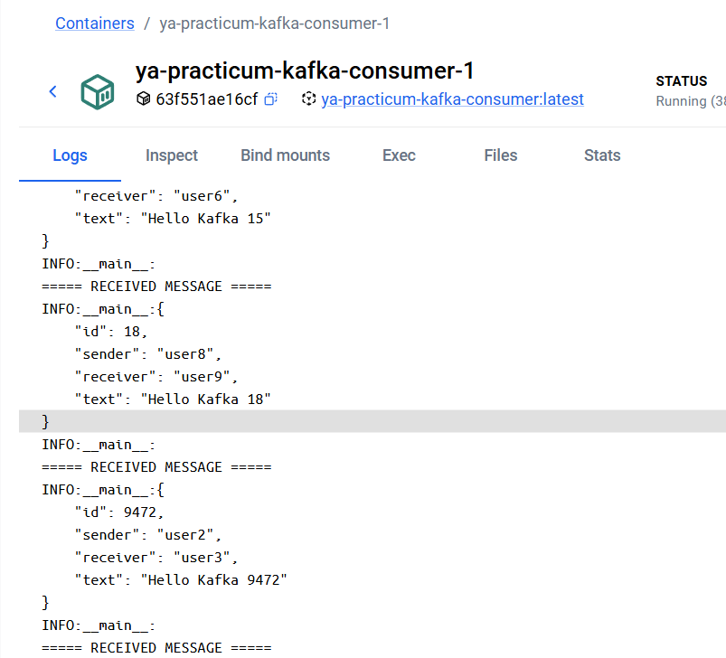
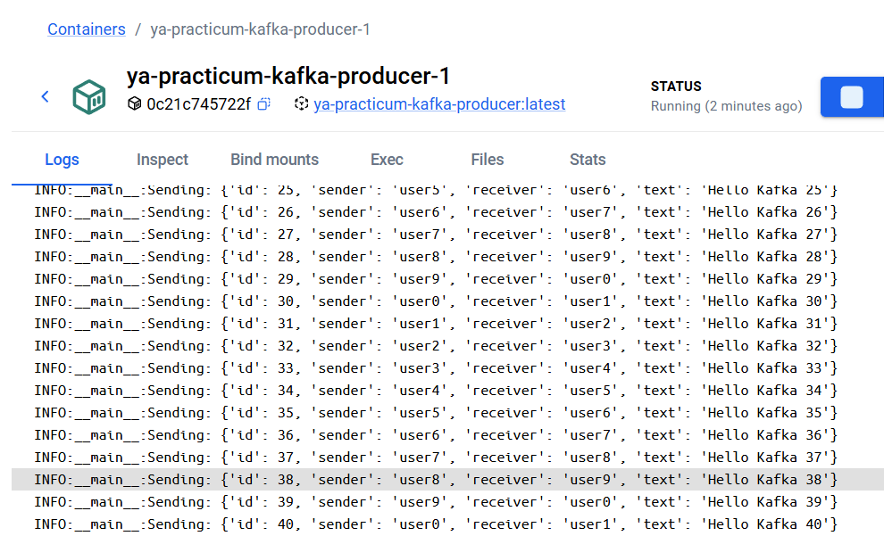
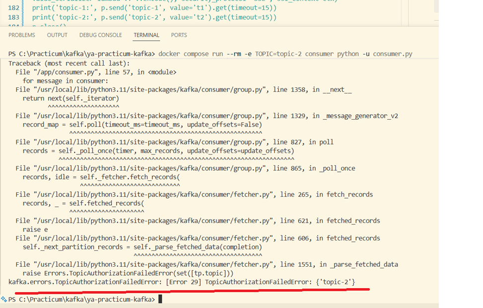
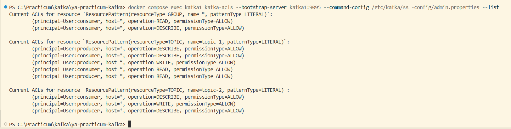

# Kafka-кластер: 3 брокера + SSL + ACL (KRaft)

## Содержание

1. [Архитектура](#1-архитектура)
2. [Структура проекта](#2-структура-проекта)
3. [Предварительные требования](#3-предварительные-требования)
4. [Шаг 1. Генерация сертификатов](#шаг-1-генерация-сертификатов)
5. [Шаг 2. Запуск кластера](#шаг-2-запуск-кластера)
6. [Шаг 3. Создание топиков](#шаг-3-создание-топиков)
7. [Шаг 4. Настройка ACL](#шаг-4-настройка-acl)
8. [Полная последовательность проверки](#шаг-5-полная-последовательность-проверки)
9. [Остановка и перезапуск](#шаг-6-остановка-и-перезапуск)
10. [Запуск на другом компьютере](#шаг-7-запуск-на-другом-компьютере)
11. [Известные особенности и решения](#11-известные-особенности-и-решения)

---

## 1. Архитектура

| Компонент | Описание |
|---|---|
| `kafka1`, `kafka2`, `kafka3` | Брокеры KRaft, роли `broker,controller` |
| Контроллерный кворум | 3 узла (quorum voters) на PLAINTEXT-листенере `9093` |
| SSL-листенер | порты `9095` / `9096` / `9097`, mTLS |
| `producer` | Python-клиент (kafka-python), пишет в `topic-1` |
| `consumer` | Python-клиент (kafka-python), читает из `topic-1` |
| Авторизация | `StandardAuthorizer`, `allow.everyone.if.no.acl.found=false` |

Схема листенеров брокера (например, kafka1):

- `CONTROLLER://0.0.0.0:9093` — внутренний контрольный трафик, PLAINTEXT (только в контейнерной сети);
- `SSL://0.0.0.0:9095` — клиентский и межброкерский трафик, SSL с взаимной аутентификацией.

### Схема прав (ACL)

| Топик | Продюсер (`User:producer`) | Консьюмер (`User:consumer`) |
|---|---|---|
| `topic-1` | DESCRIBE, READ, WRITE | DESCRIBE, READ |
| `topic-2` | DESCRIBE, WRITE | DESCRIBE (читать **не может**) |
| Группа `*` | — | DESCRIBE, READ |

Суперпользователи (`KAFKA_SUPER_USERS`): `User:admin`, `User:kafka1`, `User:kafka2`,
`User:kafka3`, `User:ANONYMOUS`.

---

## 2. Структура проекта

```
.
├── docker-compose.yaml          # кластер (3 брокера) + producer + consumer
├── producer/
│   ├── Dockerfile
│   ├── requirements.txt         # kafka-python==2.0.2
│   └── producer.py              # шлёт JSON-сообщения в топик
├── consumer/
│   ├── Dockerfile
│   └── consumer.py              # читает сообщения из топика
├── ssl/
│   ├── generate-certs.sh        # генерация CA, keystore, truststore, PEM
│   ├── certs/                   # сгенерированные сертификаты
│   └── config/
│       ├── admin.properties     # SSL-конфиг админа для утилит (kafka-acls, ...)
│       ├── producer.properties  # SSL-конфиг клиента-продюсера
│       ├── consumer.properties  # SSL-конфиг клиента-консьюмера
│       ├── create-topics.sh     # создание топиков (отдельный скрипт)
│       └── setup-acls.sh        # настройка ACL (отдельный скрипт)
```

---

## 3. Требования для запуска проекта

- Docker с Docker Compose
- `openssl` и `keytool` (JDK) — только для генерации сертификатов

---

## Шаг 1. Генерация сертификатов

Сертификаты уже сгенерированы и лежат в `ssl/certs/` (каталог игнорируется git).

Если хотчется сгенерировать заново можно запустить скрипт:

```bash
docker run --rm -v ${PWD}/ssl:/ssl -w /ssl confluentinc/cp-kafka:7.5.0 bash generate-certs.sh
```

Скрипт создаёт:

- самоподписанный CA (`ca-cert`, `ca-key`);
- `kafka.truststore.jks` — общий truststore брокеров и клиентов;
- `kafka{1..3}.keystore.jks` — keystore брокеров с SAN `DNS:kafkaN`;
- `client.{producer,consumer,admin}.keystore.jks` — keystore клиентов;
- `client.{producer,consumer,admin}-{cert,key}.pem` — PEM для Python-клиентов.

Пароль всех хранилищ по умолчанию: `kafka123` (он же в `credentials`).

> **Важно.** 
> 
> CN сертификата клиента становится принципалом в ACL.
> 
> Для `client.producer` CN = `producer` → принципал `User:producer`, и т.д.

---

## Шаг 2. Запуск кластера

```bash
docker compose up -d --build
```

Проверка, что все брокеры поднялись и healthy:


Три брокера должны иметь статус `Up ... (healthy)`.

> **Первый запуск / после `down` без `-v`:** топики и ACL хранятся внутри
> контейнеров брокеров и исчезают при удалении контейнеров — выполняйте шаги 3 и 4.

---

## Шаг 3. Создание топиков
Так как все скрипты были уже скопированы на брокеры kafka, то можно запускать скрипт создания топиков прямо изнутри.
Можно работать с любой kafa1\kafka2\kafka3:

```bash
docker compose exec kafka1 bash /etc/kafka/ssl-config/create-topics.sh
```

Скрипт создаёт `topic-1` и `topic-2` (3 партиции, RF=3) и выводит их список.

---

## Шаг 4. Настройка ACL
Скрипт для срздания политик доступа (ACL) также скопирован на каждый брокер.

Так что можно запускать на любом:

```bash
docker compose exec kafka1 bash /etc/kafka/ssl-config/setup-acls.sh
```

Скрипт выставляет ACL по схеме из [раздела 1](#1-архитектура) и выводит их список.

> Оба скрипта монтируются в брокеры из `ssl/config` (каталог `/etc/kafka/ssl-config`).

---

## Шаг 5. Полная последовательность проверки

### 5.0 Проверка автоматических клиентов (topic-1)

Продюсер и консьюмер из `docker-compose` работают с `topic-1` постоянно.

```bash
# продюсер шлёт сообщения каждые 2 секунды
docker compose logs -f producer

# консьюмер их читает (topic-1)
docker compose logs -f consumer
```

В логах консьюмера появляются блоки `===== RECEIVED MESSAGE =====`.



### 5.1 Продюсер пишет в topic-1 и topic-2 (у него READ/WRITE/DESCRIBE на оба)



```bash
docker compose run --rm -e TOPIC=topic-2 producer python -u -c "
import os, ssl
from kafka import KafkaProducer
ctx = ssl.create_default_context(cafile='/etc/kafka/secrets/ca-cert')
ctx.load_cert_chain('/etc/kafka/secrets/client.producer-cert.pem','/etc/kafka/secrets/client.producer-key.pem')
ctx.check_hostname = False
p = KafkaProducer(bootstrap_servers=['kafka1:9095','kafka2:9096','kafka3:9097'], value_serializer=lambda v: v.encode(), security_protocol='SSL', ssl_context=ctx)
print('topic-1:', p.send('topic-1', value='t1').get(timeout=15))
print('topic-2:', p.send('topic-2', value='t2').get(timeout=15))
p.close()
"
```

Оба вызова должны вернуть `RecordMetadata` (успех), т.е. продюсер может писать
и в `topic-1`, и в `topic-2`.

### 5.2 Консьюмер читает topic-1 (у него READ)

Автоматический консьюмер уже читает `topic-1` — см. пункт 5.0.

### 5.3 Консьюмер НЕ может читать topic-2 (только DESCRIBE) — негативный тест

```bash
docker compose run --rm -e TOPIC=topic-2 consumer python -u consumer.py
```

Ожидаемый результат — ошибка:

```
kafka.errors.TopicAuthorizationFailedError: [Error 29] TopicAuthorizationFailedError: {'topic-2'}
```




и в логах `WARNING:...Not authorized to read from topic topic-2.`
Это подтверждает, что на `topic-2` у консьюмера только `DESCRIBE`.

### 5.4 Просмотр текущих ACL

```bash
docker compose exec kafka1 kafka-acls --bootstrap-server kafka1:9095 --command-config /etc/kafka/ssl-config/admin.properties --list
```


---

## Шаг 6. Остановка и перезапуск

Остановить:

```bash
docker compose down
```

Запустить снова (топики/ACL не персистятся):

```bash
docker compose up -d --build
docker compose exec kafka1 bash /etc/kafka/ssl-config/create-topics.sh
docker compose exec kafka1 bash /etc/kafka/ssl-config/setup-acls.sh
```

Полностью удалить вместе с данными:

```bash
docker compose down -v
```

---

## 10. Запуск на другом компьютере

Склонируйте репозиторий и запустите из его корня — весь код, сертификаты
(`ssl/certs/`) и скрипты уже входят в репозиторий:

```bash
git clone <URL-репозитория> ya-practicum-kafka
cd ya-practicum-kafka

# 1) собрать и поднять кластер
docker compose up -d --build

# 2) создать топики
docker compose exec kafka1 bash /etc/kafka/ssl-config/create-topics.sh

# 3) настроить ACL
docker compose exec kafka1 bash /etc/kafka/ssl-config/setup-acls.sh

# 4) проверка (см. раздел 5)
docker compose logs -f producer
docker compose logs -f consumer
```

Так как сертификаты, ключи и скрипты хранятся в репозитории (`ssl/`),
отдельной генерации на целевой машине не требуется.

---

## 11. Известные особенности и решения

**`AuthorizerNotReadyException` на старте (VOTE/FETCH).**
Контроллерный листенер `CONTROLLER` использует PLAINTEXT, и запросы по нему
идут с принципалом `Anonymous`, а авторизатор ещё «не готов». Решение —
добавить `User:ANONYMOUS` в `KAFKA_SUPER_USERS` и задать
`KAFKA_EARLY_START_LISTENERS: CONTROLLER`.

**Разделитель в `KAFKA_SUPER_USERS` — только `;`.**
`StandardAuthorizer.getConfiguredSuperUsers()` разбивает список по `;`.
Значение через запятую парсится как один принципиал и не работает.

**`[Error 31] ClusterAuthorizationFailedError` у продюсера.**
Идемпотентный продюсер шлёт `InitProducerId`, что требует операцию
`IDEMPOTENT_WRITE` на ресурсе CLUSTER. В стенде kafka-python==2.0.2, которая
идемпотентность не использует, поэтому отдельной CLUSTER-ACL не нужно.

**`KAFKA_AUTO_CREATE_TOPICS_ENABLE: false`.**
Автосоздание топиков выключено, чтобы лишние топики не создавались
неавторизованными клиентами.

**Безопасность секретов.**
Каталог `ssl/certs/` содержит приватные ключи и пароли хранилищ —
убедитесь, что репозиторий (remote) приватный. Каталог `temp/` из git исключён
(`.gitignore`).